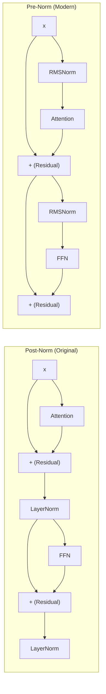

# Normalization Layers

Normalization layers re-scale intermediate activations so that each sub-layer
receives inputs with controlled statistics.  Without normalization, deep
transformer networks are notoriously difficult to train: activations drift, gradients
explode or vanish, and learning rates must be tuned to unreasonably small values.
This page covers every normalization technique relevant to modern LLMs, with
particular emphasis on **RMSNorm** (used in LLaMA / Mistral) and
**LayerNorm** (used in GPT / BERT).

---

## 1. Internal Covariate Shift

!!! definition "Internal Covariate Shift"

    The change in the distribution of a layer's inputs caused by updates to
    the parameters of preceding layers during training.[^1]

When every gradient step shifts the input distribution of downstream layers,
those layers must continuously re-adapt.  This slows convergence and forces
conservative learning rates.  Normalization combats the problem by ensuring
that, regardless of what the preceding layers produce, the inputs to each
sub-layer have zero mean and unit variance (or at least controlled scale).

Even at **inference time** (where weights are frozen), normalization is still
applied because the model was trained to expect normalized inputs.  Removing it
would change the function the network computes.

---

## 2. Layer Normalization

!!! definition "Layer Normalization (Ba et al. 2016)"

    For an input vector \( x \in \mathbb{R}^d \):

    \[
        y = \gamma \cdot \frac{x - \mu}{\sqrt{\sigma^2 + \epsilon}} + \beta
    \]

    where

    \[
        \mu = \frac{1}{d}\sum_{i=1}^{d} x_i, \qquad
        \sigma^2 = \frac{1}{d}\sum_{i=1}^{d}(x_i - \mu)^2
    \]

    and \(\gamma, \beta \in \mathbb{R}^d\) are learnable scale and shift
    parameters, and \(\epsilon\) is a small constant for numerical
    stability (typically \(10^{-6}\)).[^2]

### 2.1 Key Properties

- **Per-sample normalization:** Statistics are computed over the feature
  dimension for each sample independently.  This means LayerNorm behaves
  identically at training and inference time, unlike BatchNorm.
- **Two learnable parameters per feature:** \(\gamma\) (scale) allows the
  layer to recover the original scale if needed; \(\beta\) (shift) allows
  recovery of an arbitrary mean.
- **Invariances:** The output is invariant to shifting and scaling of the
  input along the feature dimension.

### 2.2 Gradient Through LayerNorm

The Jacobian of LayerNorm is not a simple diagonal matrix.  For input \(x\),
the derivative of the normalized output \(\hat{x}_i = (x_i - \mu)/\sqrt{\sigma^2 + \epsilon}\)
with respect to \(x_j\) is:

\[
    \frac{\partial \hat{x}_i}{\partial x_j} =
    \frac{1}{\sqrt{\sigma^2+\epsilon}}
    \left(\delta_{ij} - \frac{1}{d} - \frac{\hat{x}_i \hat{x}_j}{d}\right)
\]

where \(\delta_{ij}\) is the Kronecker delta.  This couples all features
through the mean and variance terms, which can be beneficial for learning but
adds computational cost in training.

---

## 3. RMS Normalization

!!! definition "RMSNorm (Zhang & Sennrich 2019)"

    \[
        y = \gamma \cdot \frac{x}{\operatorname{RMS}(x) + \epsilon}
    \]

    where

    \[
        \operatorname{RMS}(x) = \sqrt{\frac{1}{d}\sum_{i=1}^{d} x_i^2}
    \][^3]

### 3.1 Differences from LayerNorm

| Aspect | LayerNorm | RMSNorm |
|---|---|---|
| Mean subtraction | Yes | **No** |
| Shift parameter \(\beta\) | Yes | **No** |
| Learnable parameters | \(2d\) | \(d\) |
| Invariance | Shift + scale | Scale only |
| Relative speed | Baseline | **~15% faster** |

RMSNorm's simplification is motivated by the empirical observation that the
re-centering (mean subtraction) in LayerNorm contributes little to model
quality in transformer architectures, while the re-scaling (division by RMS) is
the component that matters most for stabilizing activations.[^3]

### 3.2 Computational Advantage

RMSNorm saves computation in two ways:

1. **One fewer reduction:** No need to compute the mean \(\mu\).
2. **Fewer parameters:** No \(\beta\) vector to store or apply.

For a model with \(d = 4096\) and 80 layers (LLaMA-65B scale), eliminating
the mean computation and shift parameter across all normalization sites saves
measurable wall-clock time and memory bandwidth.

---

## 4. Batch Normalization (Brief Treatment)

!!! definition "Batch Normalization (Ioffe & Szegedy 2015)"

    Normalizes across the **batch dimension** rather than the feature dimension:

    \[
        y_i = \gamma \cdot \frac{x_i - \mu_{\text{batch}}}{\sqrt{\sigma_{\text{batch}}^2 + \epsilon}} + \beta
    \]

    where statistics are computed over all samples in the mini-batch for each
    feature independently.[^1]

**Why BatchNorm is rarely used in transformers:**

- Variable sequence lengths make batch statistics inconsistent.
- Small batch sizes (common in LLM training) yield noisy statistics.
- Different behavior at training vs. inference (running averages) introduces
  discrepancies.
- LayerNorm provides the same stabilization benefits without these drawbacks.

---

## 5. Group Normalization (Brief Treatment)

!!! definition "Group Normalization (Wu & He 2018)"

    Divides the feature dimension into \(G\) groups and normalizes within each
    group independently:

    \[
        y_i = \gamma_i \cdot \frac{x_i - \mu_{g(i)}}{\sqrt{\sigma_{g(i)}^2 + \epsilon}} + \beta_i
    \]

    where \(g(i)\) maps feature index \(i\) to its group.[^4]

GroupNorm interpolates between LayerNorm (\(G=1\)) and InstanceNorm (\(G=d\)).
It is primarily used in vision models (e.g., with convolutional networks) and
is uncommon in transformer-based LLMs.

---

## 6. Pre-Norm vs Post-Norm Placement

The placement of normalization layers relative to attention and feed-forward
sub-layers has a significant impact on training stability and gradient flow.

### 6.1 Post-Norm (Original Transformer)

The original "Attention Is All You Need" architecture applies normalization
*after* the residual addition:

\[
    x' = \operatorname{Norm}(x + \operatorname{Attn}(x))
\]

### 6.2 Pre-Norm (Modern Standard)

Most modern architectures (LLaMA, GPT-3, Mistral) apply normalization *before*
the sub-layer:

\[
    x' = x + \operatorname{Attn}(\operatorname{Norm}(x))
\]

### 6.3 Gradient Flow Analysis

!!! algorithm "Gradient Flow Comparison"

    **Post-Norm** gradient path through \(L\) layers:

    \[
        \frac{\partial \mathcal{L}}{\partial x_0} =
        \frac{\partial \mathcal{L}}{\partial x_L}
        \prod_{\ell=1}^{L} \frac{\partial\, \operatorname{Norm}(x_\ell + f_\ell(x_\ell))}{\partial x_\ell}
    \]

    The normalization Jacobian at each layer can attenuate or amplify gradients
    unpredictably.

    **Pre-Norm** gradient path:

    \[
        \frac{\partial \mathcal{L}}{\partial x_0} =
        \frac{\partial \mathcal{L}}{\partial x_L}
        \prod_{\ell=1}^{L}
        \left(I + \frac{\partial f_\ell(\operatorname{Norm}(x_\ell))}{\partial x_\ell}\right)
    \]

    The identity matrix \(I\) in each factor ensures that even if
    \(\partial f_\ell / \partial x_\ell\) is small, the gradient is *at least*
    propagated through the skip connection.

### 6.4 Comparison Diagram



!!! tip "Practical Guidance"

    Pre-Norm is strongly preferred for deep transformers (\(L > 24\)).
    Post-Norm can work for shallow models but often requires learning rate
    warmup and careful initialization to avoid divergence.

---

## 7. Implementation in ZigLlama

### 7.1 Normalization Type Enum

```zig
pub const NormalizationType = enum {
    LayerNorm,   // Standard Layer Normalization
    RMSNorm,     // Root Mean Square Normalization
    BatchNorm,   // Batch Normalization (less common in transformers)
    GroupNorm,   // Group Normalization
};
```

### 7.2 LayerNorm

```zig
pub fn layerNorm(
    comptime T: type,
    input: Tensor(T),
    scale: ?Tensor(T),   // gamma
    shift: ?Tensor(T),   // beta
    allocator: Allocator,
) TensorError!Tensor(T) {
    const last_dim = input.shape[input.shape.len - 1];
    const batch_size = input.size / last_dim;

    var result = try Tensor(T).init(allocator, input.shape);

    for (0..batch_size) |batch_idx| {
        const offset = batch_idx * last_dim;

        // Pass 1: mean
        var sum: T = 0.0;
        for (0..last_dim) |i| sum += input.data[offset + i];
        const mean = sum / @as(T, @floatFromInt(last_dim));

        // Pass 2: variance
        var var_sum: T = 0.0;
        for (0..last_dim) |i| {
            const diff = input.data[offset + i] - mean;
            var_sum += diff * diff;
        }
        const std_dev = @sqrt(var_sum / @as(T, @floatFromInt(last_dim)) + NORM_EPSILON);

        // Normalize + affine transform
        for (0..last_dim) |i| {
            var val = (input.data[offset + i] - mean) / std_dev;
            if (scale) |s| val *= s.data[i];
            if (shift) |b| val += b.data[i];
            result.data[offset + i] = val;
        }
    }
    return result;
}
```

### 7.3 RMSNorm

```zig
pub fn rmsNorm(
    comptime T: type,
    input: Tensor(T),
    scale: ?Tensor(T),   // gamma (no beta)
    allocator: Allocator,
) TensorError!Tensor(T) {
    const last_dim = input.shape[input.shape.len - 1];
    const batch_size = input.size / last_dim;

    var result = try Tensor(T).init(allocator, input.shape);

    for (0..batch_size) |batch_idx| {
        const offset = batch_idx * last_dim;

        // Single pass: sum of squares
        var sum_sq: T = 0.0;
        for (0..last_dim) |i| {
            const x = input.data[offset + i];
            sum_sq += x * x;
        }
        const rms = @sqrt(sum_sq / @as(T, @floatFromInt(last_dim)) + NORM_EPSILON);

        // Normalize + scale
        for (0..last_dim) |i| {
            var val = input.data[offset + i] / rms;
            if (scale) |s| val *= s.data[i];
            result.data[offset + i] = val;
        }
    }
    return result;
}
```

### 7.4 Dispatcher

```zig
pub fn applyNormalization(
    comptime T: type,
    norm_type: NormalizationType,
    input: Tensor(T),
    scale: ?Tensor(T),
    shift: ?Tensor(T),
    allocator: Allocator,
) TensorError!Tensor(T) {
    return switch (norm_type) {
        .LayerNorm => layerNorm(T, input, scale, shift, allocator),
        .RMSNorm   => rmsNorm(T, input, scale, allocator),
        .BatchNorm => batchNorm(T, input, scale, shift, allocator),
        .GroupNorm => groupNorm(T, input, 8, scale, shift, allocator),
    };
}
```

!!! info "Source File"

    Full implementation: `src/neural_primitives/normalization.zig`
    (approximately 570 lines including tests and the numerically stable
    `computeStableStats` helper).

---

## 8. Numerical Stability

### 8.1 The Two-Pass Algorithm

ZigLlama uses a **two-pass** algorithm for computing variance (LayerNorm):

1. **First pass:** compute \(\mu\).
2. **Second pass:** compute \(\sigma^2\) using the known \(\mu\).

The naive one-pass formula \(\sigma^2 = \mathbb{E}[X^2] - (\mathbb{E}[X])^2\)
suffers from catastrophic cancellation when the variance is small relative to
the mean.  The two-pass approach avoids this.

### 8.2 Epsilon Selection

The constant \(\epsilon = 10^{-6}\) is added inside the square root to prevent
division by zero when all elements are identical.  For `f16` inference (not yet
supported in ZigLlama), a larger \(\epsilon = 10^{-3}\) is typical.

---

## 9. Which Models Use What?

| Model | Normalization | Placement | Notes |
|---|---|---|---|
| Original Transformer | LayerNorm | Post-Norm | Vaswani et al. 2017 |
| BERT | LayerNorm | Post-Norm | Devlin et al. 2019 |
| GPT-2 / GPT-3 | LayerNorm | Pre-Norm | Radford et al. 2019 |
| LLaMA / LLaMA 2 | **RMSNorm** | Pre-Norm | Touvron et al. 2023 |
| Mistral | **RMSNorm** | Pre-Norm | Jiang et al. 2023 |
| PaLM | **RMSNorm** | Pre-Norm | Chowdhery et al. 2022 |
| Falcon | LayerNorm | Pre-Norm | Penedo et al. 2023 |
| T5 | RMSNorm | Pre-Norm | Raffel et al. 2020 |

---

## 10. Exercises

1. **Derive** the Jacobian \(\partial \hat{x}/\partial x\) for RMSNorm and
   compare its rank with the LayerNorm Jacobian.
2. **Show** that LayerNorm is invariant to adding a constant vector \(c \cdot \mathbf{1}\)
   to the input, while RMSNorm is not.
3. **Measure** the wall-clock difference between LayerNorm and RMSNorm on a
   \(2048 \times 4096\) tensor in ZigLlama.  Does the ~15% claim hold on your
   hardware?

---

## References

[^1]: Ioffe, S. & Szegedy, C. "Batch Normalization: Accelerating Deep Network Training by Reducing Internal Covariate Shift." *ICML*, 2015.
[^2]: Ba, J. L., Kiros, J. R. & Hinton, G. E. "Layer Normalization." *arXiv:1607.06450*, 2016.
[^3]: Zhang, B. & Sennrich, R. "Root Mean Square Layer Normalization." *NeurIPS*, 2019.
[^4]: Wu, Y. & He, K. "Group Normalization." *ECCV*, 2018.
[^5]: Xiong, R. et al. "On Layer Normalization in the Transformer Architecture." *ICML*, 2020.
