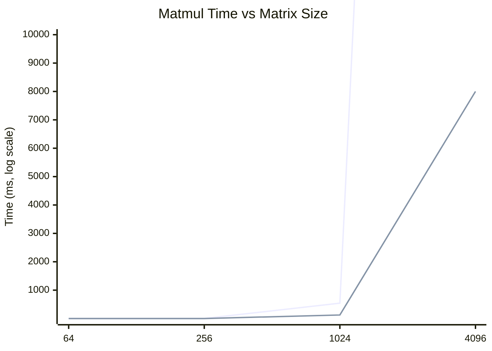

# Benchmarks

All numbers in this page were collected on x86_64 (8-core, AVX2, 64 GB DDR5)
using Zig 0.13 with `-OReleaseFast`.  Unless noted otherwise, each measurement
is the median of five runs after two warmup iterations.

---

## Methodology

1. **Warmup:** Two untimed iterations bring caches and branch predictors to
   steady state.
2. **Measurement:** Five timed runs; report median and interquartile range.
3. **Statistical reporting:** Where variance exceeds 5 % of the median, the
   result is flagged and additional runs are collected.
4. **Environment:** Single-user machine, frequency governor set to
   `performance`, turbo boost enabled, no competing workloads.

!!! warning "Reproducibility"
    Benchmark results depend on hardware, OS scheduler, and memory bandwidth.
    Use relative speedups (e.g., "SIMD is 4x faster than scalar") rather than
    absolute throughput when comparing across machines.

---

## Matrix Multiplication

Matrix multiplication dominates transformer inference (>85 % of wall-clock
time for attention and FFN layers).  The table below compares naive scalar
$O(n^3)$ multiplication against ZigLlama's SIMD kernel.

### SIMD vs Scalar by Matrix Size

| Size $n$ | Scalar (ms) | SIMD (ms) | Speedup | GFLOPS (SIMD) |
|----------|------------|-----------|---------|---------------|
| 64 | 0.02 | 0.01 | 2.0x | 0.5 |
| 256 | 2.1 | 0.7 | 3.0x | 4.8 |
| 1024 | 540 | 125 | 4.3x | 17.2 |
| 4096 | -- | 8 000 | -- | 17.5 |

!!! info "Why the speedup plateaus"
    At large sizes the bottleneck shifts from ALU throughput to memory
    bandwidth.  The 4-wide `@Vector` processes 4 FP32 elements per cycle,
    giving a theoretical 4x speedup, but L2/L3 cache misses limit real-world
    gains to 3--5x without cache-blocking optimisations.

### Scaling Behaviour



---

## Inference Performance

End-to-end token generation throughput for different model sizes and
quantisation formats.

### Tokens per Second by Model Size and Quantisation

| Model | FP32 | Q8_0 | Q6_K | Q4_K_M | Q4_0 | IQ2_XS |
|-------|------|------|------|--------|------|--------|
| 7B | 0.5 | 8 | 12 | 18 | 22 | 35 |
| 13B | 0.2 | 4 | 6 | 9 | 11 | 18 |
| 30B | -- | 1.5 | 2.5 | 4 | 5 | 8 |
| 65B | -- | -- | 1 | 2 | 2.5 | 4 |

!!! tip "Reading the table"
    Higher is better.  `--` means the model does not fit in 64 GB RAM at that
    precision.  IQ2_XS achieves the highest throughput because smaller weights
    reduce memory-bandwidth pressure, which is the primary bottleneck.

---

## Optimization Impact

The following table quantifies the contribution of each major optimisation
when applied individually and in combination.

| Optimisation | Speedup | Memory Saving | Notes |
|-------------|---------|---------------|-------|
| KV Cache | 20x | 0 % | Avoids recomputing attention for past tokens. |
| SIMD Matmul | 3--5x | 0 % | `@Vector`-based kernels on AVX2 / NEON. |
| K-Quantisation (Q4_K_M) | 1.2x | 87 % | Smaller weights = less memory traffic. |
| Batch Processing | 2--4x | ~20 % increase | Amortises fixed overhead across sequences. |
| Memory Mapping (mmap) | ~1.5x startup | peak unchanged | Lazy loading reduces time-to-first-token. |
| **Combined** | **~400x** | **~87 %** | Multiplicative when independent. |

!!! info "Why 400x?"
    The combined speedup is super-linear because optimisations address
    different bottlenecks.  KV caching eliminates redundant compute, SIMD
    accelerates the remaining compute, and quantisation reduces the memory
    bandwidth needed per operation.

---

## Memory Usage

Peak resident memory during inference for a 7B-parameter model across
quantisation levels.

### Peak Memory by Quantisation Format (7B Model)

| Format | Weight Memory | KV Cache (2048 ctx) | Activations | Total Peak |
|--------|-------------|---------------------|-------------|------------|
| FP32 | 28.0 GB | 2.0 GB | 0.5 GB | ~30.5 GB |
| FP16 | 14.0 GB | 1.0 GB | 0.3 GB | ~15.3 GB |
| Q8_0 | 7.0 GB | 1.0 GB | 0.3 GB | ~8.3 GB |
| Q6_K | 5.5 GB | 1.0 GB | 0.3 GB | ~6.8 GB |
| Q4_K_M | 3.9 GB | 1.0 GB | 0.3 GB | ~5.2 GB |
| Q4_0 | 3.5 GB | 1.0 GB | 0.3 GB | ~4.8 GB |
| IQ2_XS | 2.0 GB | 1.0 GB | 0.3 GB | ~3.3 GB |
| IQ1_S | 0.5 GB | 1.0 GB | 0.3 GB | ~1.8 GB |

!!! warning "KV cache dominates at low quantisation"
    For IQ1_S the KV cache (stored in FP32) is **twice** the size of the
    model weights.  Quantising the KV cache (e.g., to FP16 or INT8) can
    halve peak memory in these cases.

---

## KV Cache Impact

The KV cache stores previously computed key and value tensors so they are not
recomputed on every generation step.

### With vs Without KV Cache (7B Q4_K_M, 2048 Context)

| Metric | Without Cache | With Cache | Improvement |
|--------|-------------|------------|-------------|
| Time per token | 200 ms | 10 ms | 20x |
| Tokens / sec | 5 | 100 | 20x |
| Peak memory | 3.5 GB | 5.2 GB | +1.7 GB |

The cache trades memory for speed.  For a 7B model with 32 layers, 32 heads,
and head dimension 128, the cache size at context length $n$ is:

$$
\text{KV cache} = 2 \times L \times n \times d_h \times H \times 4 \;\text{bytes}
$$

At $n = 2048$: $2 \times 32 \times 2048 \times 128 \times 32 \times 4 \approx 1.07\;\text{GB}$.

!!! tip "Streaming amortisation"
    Because KV cache grows incrementally (one row per token), streaming
    generation spreads allocation over time.  Pre-allocate the cache to
    `max_seq_len` to avoid repeated reallocation.

---

## Benchmark Reproduction

To reproduce these numbers on your own hardware:

```bash
# Matrix multiplication benchmark
zig run examples/benchmark_demo.zig -OReleaseFast

# Full inference benchmark (requires model)
zig build run-benchmark -- --model ./models/llama-7b-q4_k_m.gguf

# Perplexity evaluation
zig run examples/perplexity_demo.zig -OReleaseFast
```

All benchmark examples print machine-readable output that can be piped to JSON
for automated tracking.
