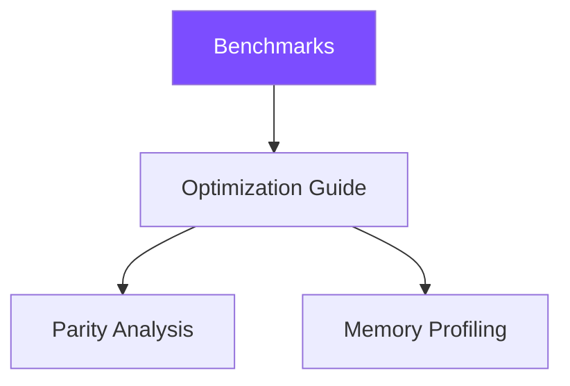

# Performance

This section provides quantitative data and actionable guidance for
understanding and improving ZigLlama's inference throughput, memory
consumption, and output quality.

---

## Section Overview

| Page | Description |
|------|-------------|
| [Benchmarks](benchmarks.md) | Methodology, matrix-multiplication timings, inference throughput, KV cache impact, and memory usage tables. |
| [Optimization Guide](optimization-guide.md) | Practical steps for profiling bottlenecks and applying SIMD, quantization, caching, and threading optimizations. |
| [Parity Analysis](parity-analysis.md) | Feature-by-feature and performance comparison with llama.cpp. |
| [Memory Profiling](memory-profiling.md) | Formulas for predicting model, activation, and KV cache memory; leak-detection workflow with Zig's GPA. |

---

## Key Performance Numbers (7B Model, CPU-Only)

| Metric | Unoptimised | Fully Optimised |
|--------|------------|-----------------|
| Tokens / second | ~5 | ~200 |
| Time per token | ~200 ms | ~5 ms |
| Peak memory (FP32) | 28 GB | -- |
| Peak memory (Q4_K_M) | -- | ~3.9 GB |
| KV cache speedup | 1x | 20x |
| SIMD speedup (matmul) | 1x | 3--5x |
| Combined speedup | 1x | ~400x |

!!! info "Hardware"
    Numbers above are representative of a 2024-era x86_64 workstation
    (8-core, AVX2) running Zig 0.13 with `-OReleaseFast`.  Your results
    will vary with CPU, memory bandwidth, and model size.
