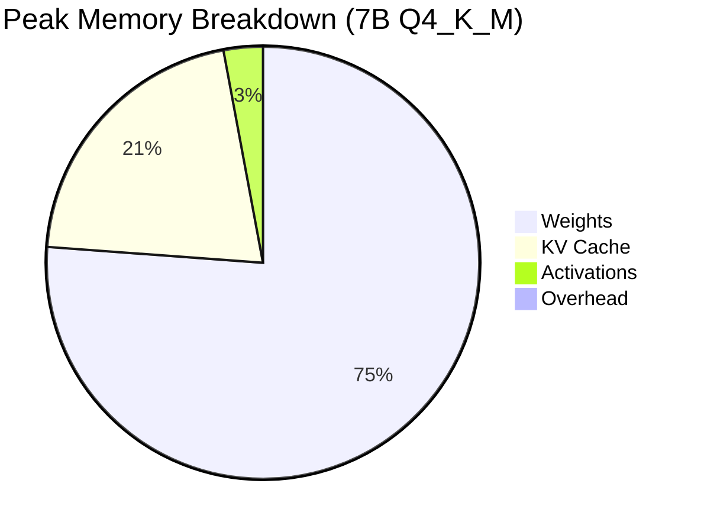

# Memory Profiling

Accurate memory prediction is essential for choosing quantisation levels,
setting context lengths, and provisioning hardware.  This page derives the
formulas for each memory component and shows how to use Zig's built-in tools
to detect leaks and measure peak usage.

---

## Zig's GeneralPurposeAllocator and Leak Detection

Zig's `GeneralPurposeAllocator` (GPA) is a debug allocator that tracks every
allocation and reports leaks when `deinit` is called:

```zig
var gpa = std.heap.GeneralPurposeAllocator(.{
    .stack_trace_frames = 8,  // capture 8 frames per allocation
}){};
defer {
    const status = gpa.deinit();
    if (status == .leak) {
        std.log.err("LEAK DETECTED", .{});
    }
}
const allocator = gpa.allocator();
```

When a leak is found, GPA prints the stack trace of the offending allocation:

```
error: memory leak at 0x7f3a2c001000 (4096 bytes)
  src/models/llama.zig:142:25: LLaMAModel.init
  src/server/http_server.zig:182:19: ZigLlamaServer.loadModel
  examples/main.zig:23:5: main
```

!!! tip "Release builds"
    GPA is active only in debug and `ReleaseSafe` modes.  In `ReleaseFast`
    the allocator degrades to a thin wrapper around `malloc` with no tracking
    overhead.

### Workflow

1. Run the test suite under GPA: `zig build test`.
2. If GPA reports zero leaks, the allocator contract is satisfied.
3. For long-running server processes, periodically log
   `gpa.total_requested_bytes` to monitor growth.

---

## Model Memory Budget

### Parameter Count Formula

For a standard LLaMA-style transformer with $L$ layers and embedding
dimension $d$:

$$
\text{params} \approx 12Ld^2
$$

This accounts for four projection matrices per layer ($W^Q$, $W^K$, $W^V$,
$W^O$, each $d \times d$), the FFN gate and up projections
($d \times \tfrac{8}{3}d$ each), and the down projection.

| Model | $L$ | $d$ | Params (formula) | Params (actual) |
|-------|-----|-----|-----------------|-----------------|
| 7B | 32 | 4096 | 6.4 B | 6.7 B |
| 13B | 40 | 5120 | 12.6 B | 13.0 B |
| 30B | 60 | 6656 | 31.9 B | 32.5 B |
| 65B | 80 | 8192 | 64.4 B | 65.2 B |

!!! info "Discrepancy"
    The formula slightly undercounts because it omits the embedding table
    ($V \times d$, where $V$ is the vocabulary size) and the final RMSNorm
    parameters ($d$ per layer).  These contribute <5 % of total parameters.

### Weight Memory

Given the parameter count and the number of bits per weight ($b$):

$$
\text{weight memory} = \frac{\text{params} \times b}{8} \;\text{bytes}
$$

| Format | $b$ | 7B Size | 13B Size | 65B Size |
|--------|-----|---------|----------|----------|
| FP32 | 32 | 28.0 GB | 52.0 GB | 260 GB |
| FP16 | 16 | 14.0 GB | 26.0 GB | 130 GB |
| Q8_0 | 8 | 7.0 GB | 13.0 GB | 65 GB |
| Q6_K | 6.5 | 5.5 GB | 10.6 GB | 53 GB |
| Q4_K_M | 4.5 | 3.9 GB | 7.3 GB | 37 GB |
| Q4_0 | 4 | 3.5 GB | 6.5 GB | 33 GB |
| IQ2_XS | 2.3 | 2.0 GB | 3.7 GB | 19 GB |

---

## Activation Memory

During a forward pass, each transformer layer produces intermediate
activations.  For a single token at position $n$ in a model with dimension $d$:

$$
\text{activation per layer} = O(n \cdot d)
$$

Concretely, the dominant activations are:

| Activation | Shape | Size (FP32) |
|-----------|-------|-------------|
| Attention scores | $H \times n \times n$ | $4Hn^2$ bytes |
| QKV projections | $3 \times n \times d$ | $12nd$ bytes |
| FFN intermediate | $n \times \tfrac{8}{3}d$ | $\tfrac{32}{3}nd$ bytes |

For a 7B model ($d=4096$, $H=32$) at context length $n=2048$:

- Attention scores: $4 \times 32 \times 2048^2 \approx 537\;\text{MB}$
  (per layer, without KV cache)
- QKV projections: $12 \times 2048 \times 4096 \approx 96\;\text{MB}$
- FFN intermediate: $\tfrac{32}{3} \times 2048 \times 4096 \approx 89\;\text{MB}$

!!! warning "Activation memory scales quadratically"
    The attention-score tensor grows as $O(n^2)$.  At $n=8192$ the scores
    alone require 8.6 GB per layer.  This is why KV caching (which reduces
    attention to $O(n)$ per step) is essential for long contexts.

In practice, ZigLlama only materialises one layer's activations at a time,
reusing the buffer across layers.  Peak activation memory is therefore a
single layer's worth, not $L$ layers.

---

## KV Cache Memory

The KV cache stores the key and value tensors for all layers and all past
positions.  For $L$ layers, $H$ heads, head dimension $d_h$, and context
length $n$:

$$
\text{KV cache} = 2 \times L \times n \times d_h \times H \times 4 \;\text{bytes (FP32)}
$$

The factor of 2 accounts for keys and values; the factor of 4 is the byte
width of `f32`.

| Model | $L$ | $H$ | $d_h$ | Cache at $n=2048$ | Cache at $n=4096$ |
|-------|-----|-----|-------|-------------------|-------------------|
| 7B | 32 | 32 | 128 | 1.07 GB | 2.15 GB |
| 13B | 40 | 40 | 128 | 1.68 GB | 3.36 GB |
| 30B | 60 | 52 | 128 | 3.25 GB | 6.50 GB |
| 65B | 80 | 64 | 128 | 5.37 GB | 10.74 GB |

!!! tip "Reducing KV cache memory"
    - **FP16 cache:** Halves the cache by storing keys/values in half
      precision.  Minimal quality impact.
    - **Grouped-query attention (GQA):** Models like LLaMA 2 70B use fewer
      KV heads than query heads, reducing the cache by $H_q / H_{kv}$.
    - **Sliding-window attention:** Mistral limits attention to a fixed
      window, capping cache size regardless of context length.

---

## Peak Memory Analysis

The total peak memory during inference is:

$$
\text{peak} = \text{weights} + \text{KV cache} + \text{activations} + \text{overhead}
$$

For a 7B Q4_K_M model at context length 2048:

| Component | Size | % of Peak |
|-----------|------|-----------|
| Weights (Q4_K_M) | 3.9 GB | 75 % |
| KV cache (FP32) | 1.07 GB | 21 % |
| Activations (1 layer) | 0.15 GB | 3 % |
| Overhead (allocator, HTTP) | 0.05 GB | 1 % |
| **Total** | **5.17 GB** | **100 %** |



---

## Optimisation Strategies

### 1. Quantise Weights

The most impactful lever.  Moving from FP16 to Q4_K_M reduces weight memory
by 3.6x.

### 2. Quantise the KV Cache

Storing keys and values in FP16 halves cache memory with negligible quality
loss.  INT8 KV cache (experimental) reduces it by 4x.

### 3. Reduce Context Length

If your application generates short responses (e.g., classification, entity
extraction), set `max_seq_len` to the minimum sufficient value.  Going from
4096 to 512 reduces KV cache by 8x.

### 4. Share Activations Across Layers

ZigLlama already does this: a single activation buffer is allocated and
reused for every layer.  Ensure custom model implementations follow the same
pattern.

### 5. Memory-Mapped Model Loading

`mmap` avoids doubling memory during loading (one copy on disk, one in RAM).
The OS page cache serves as the in-memory copy.

### 6. Monitor with GPA

```zig
// Periodically log memory usage
const bytes = gpa.total_requested_bytes;
std.log.info("Memory in use: {d:.1f} MB", .{
    @as(f64, @floatFromInt(bytes)) / (1024 * 1024),
});
```

---

## Memory Planning Calculator

Use this formula to estimate whether a model fits in your available RAM:

$$
\text{required RAM} \geq \frac{\text{params} \times b}{8} + 2Lnd_h H \times 4 + 0.2\;\text{GB}
$$

!!! example "Example: 13B Q4_K_M, context 4096"
    $$
    \frac{13 \times 10^9 \times 4.5}{8} + 2 \times 40 \times 4096 \times 128 \times 40 \times 4 + 0.2\;\text{GB}
    $$
    $$
    = 7.3\;\text{GB} + 3.36\;\text{GB} + 0.2\;\text{GB} = 10.86\;\text{GB}
    $$
    This fits comfortably in a 16 GB machine but not in 8 GB.

---

## Source Reference

| File | Key Types |
|------|-----------|
| `src/inference/kv_cache.zig` | `KVCache`, cache sizing logic |
| `src/inference/profiling.zig` | `InferenceProfiler`, memory tracking |
| `src/foundation/memory_mapping.zig` | `MemoryMappedFile` |
| `src/foundation/tensor.zig` | `Tensor`, allocation tracking |
