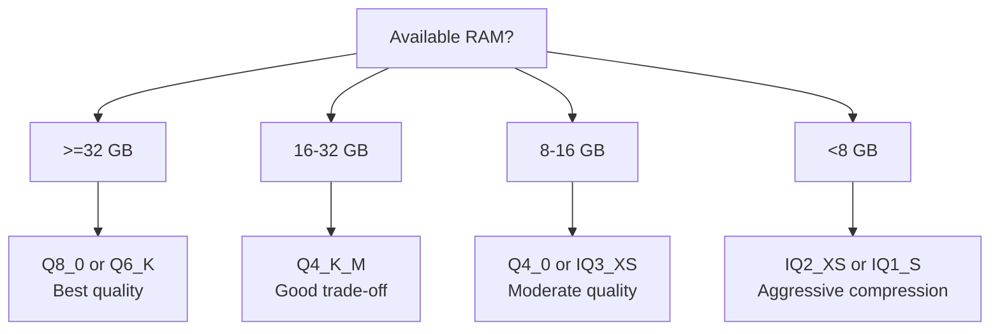

# Optimization Guide

This guide provides a systematic approach to improving ZigLlama's inference
performance.  The overarching principle is **profile first, optimise second** --
identify the actual bottleneck before applying any technique.

---

## Profile First

!!! warning "The cardinal rule"
    Never optimise without measurement.  A 10x improvement to a function that
    consumes 1 % of wall-clock time yields a 0.1 % end-to-end gain.

### Identifying Bottlenecks

ZigLlama includes a profiling module (`src/inference/profiling.zig`) that
timestamps each phase of generation:

```zig
const profiling = @import("inference/profiling.zig");

var profiler = profiling.InferenceProfiler.init(allocator);
defer profiler.deinit();

// ... run generation ...

profiler.printReport();
```

Typical output for a 7B model:

```
Phase                Time (ms)   % Total
--------------------------------------------
Tokenisation            2.1       0.4%
Embedding lookup        1.5       0.3%
Attention (QKV proj)   85.3      16.2%
Attention (softmax)    42.0       8.0%
Feed-forward          310.5      59.0%
Output projection      62.1      11.8%
Sampling                1.2       0.2%
Detokenisation          0.8       0.2%
Other                  20.5       3.9%
```

In this profile, the feed-forward network dominates.  Since FFN layers are
pure matrix multiplications, the highest-impact optimisation is SIMD matmul.

---

## Memory Optimisations

### Quantisation Selection

Choose a quantisation level based on your memory budget and quality
requirements:



| RAM Budget | 7B Recommendation | 13B Recommendation |
|-----------|-------------------|-------------------|
| 64 GB | Q8_0 | Q6_K |
| 32 GB | Q6_K | Q4_K_M |
| 16 GB | Q4_K_M | IQ3_XS |
| 8 GB | IQ3_XS | -- |
| 4 GB | IQ2_XS | -- |

### Memory-Mapped I/O

For models stored on fast SSDs, memory mapping (`mmap`) enables lazy loading
-- pages are faulted into RAM only when first accessed.  This reduces
time-to-first-token because the entire file need not be read sequentially:

```zig
const mmap = @import("foundation/memory_mapping.zig");

var mapping = try mmap.MemoryMappedFile.init(allocator, "model.gguf");
defer mapping.deinit();

// Access tensors directly through the mapped region
const tensor_data = mapping.getSlice(offset, length);
```

!!! tip "SSD vs HDD"
    Memory mapping on a spinning disk can cause severe random-access latency.
    On HDD, prefer sequential reading into a heap buffer.

### KV Cache Sizing

Pre-allocate the KV cache to the maximum expected context length to avoid
mid-generation reallocation:

```zig
const kv_cache = @import("inference/kv_cache.zig");

var cache = try kv_cache.KVCache.init(allocator, .{
    .num_layers = 32,
    .num_heads = 32,
    .head_dim = 128,
    .max_seq_len = 4096,  // pre-allocate for up to 4096 tokens
});
defer cache.deinit();
```

If memory is tight, set `max_seq_len` to the actual generation limit rather
than the model's training context length.

---

## Compute Optimisations

### SIMD Acceleration

ZigLlama uses Zig's `@Vector` type for portable SIMD:

```zig
const Vec4 = @Vector(4, f32);

fn dotProduct4(a: [*]const f32, b: [*]const f32) f32 {
    const va: Vec4 = a[0..4].*;
    const vb: Vec4 = b[0..4].*;
    const product = va * vb;
    return @reduce(.Add, product);
}
```

!!! info "Ensuring AVX2"
    Compile with `-Dcpu=x86_64_v3` (or `-OReleaseFast`) to guarantee AVX2
    code generation.  Without this flag, Zig may emit SSE2-only code that
    processes only 4 floats at a time instead of 8.

**Verification:**

```bash
# Check which SIMD extensions the binary uses
objdump -d zig-out/bin/zigllama | grep -c vfmadd
# Non-zero count confirms FMA instructions are present
```

### BLAS Integration

For the largest matrices (output projection, embedding lookup), delegating to
an optimised BLAS library can outperform hand-written SIMD by 2--3x:

```zig
const blas = @import("foundation/blas_integration.zig");

// Use system BLAS for large matmuls
blas.sgemm('N', 'N', m, n, k, 1.0, A, lda, B, ldb, 0.0, C, ldc);
```

ZigLlama detects OpenBLAS, Apple Accelerate, or Intel MKL at build time.

### Threading Configuration

The thread pool size should match the number of **physical** cores (not
logical cores with hyperthreading):

```zig
const threading = @import("foundation/threading.zig");

var pool = try threading.ThreadPool.init(allocator, .{
    .num_threads = 8,  // match physical core count
});
defer pool.deinit();
```

!!! tip "NUMA awareness"
    On multi-socket systems, pin threads to the socket closest to the model's
    memory.  ZigLlama's threading module provides NUMA topology detection.

---

## Inference Optimisations

### KV Cache

The single most impactful optimisation for autoregressive generation.  Without
a cache, every forward pass recomputes attention for all previous tokens.  With
a cache, only the new token's key/value pair is computed and appended:

| Context Length | Without Cache | With Cache | Speedup |
|---------------|-------------|------------|---------|
| 128 | 1.6 s | 0.08 s | 20x |
| 512 | 25.6 s | 0.32 s | 80x |
| 2048 | 409 s | 1.28 s | 320x |

The speedup grows linearly with context length because the cached version
is $O(n)$ per token while the non-cached version is $O(n^2)$.

### Batch Processing

When serving multiple users, batch their prompts into a single forward pass:

```zig
const batching = @import("inference/batching.zig");

var batch = try batching.InferenceBatch.init(allocator, .{
    .max_batch_size = 8,
    .max_seq_len = 2048,
});
```

Batching improves GPU utilisation and amortises the cost of weight loads
across sequences.  On CPU, the benefit is smaller (2--4x) but still
meaningful.

### Streaming

Streaming sends tokens to the client as they are generated, reducing
perceived latency to the time-to-first-token rather than the full generation
time.  No throughput change, but user experience improves dramatically.

---

## Platform-Specific Tips

### x86_64 (Intel / AMD)

- **Compile with AVX2:** `-Dcpu=x86_64_v3` or `-Dcpu=native`.
- **Enable FMA:** Fused multiply-add reduces round-off and increases
  throughput.  Zig enables FMA automatically when targeting AVX2+.
- **Large pages:** `madvise(MADV_HUGEPAGE)` on the model mmap region can
  reduce TLB misses by 10--20 % for large models.
- **Turbo boost:** Ensure the CPU governor is set to `performance` during
  benchmarks.

### ARM (Apple Silicon, Graviton)

- **NEON:** Zig's `@Vector(4, f32)` maps directly to NEON 128-bit registers.
  No special flags needed on aarch64.
- **Apple Accelerate:** Link against Accelerate for hardware-optimised BLAS
  on macOS (`-framework Accelerate` via `build.zig`).
- **Unified memory:** Apple Silicon's unified memory architecture eliminates
  the CPU-GPU copy penalty, but ZigLlama is CPU-only and does not currently
  benefit from the GPU.

### General

- **Huge pages:** Reduce TLB misses for models > 4 GB.
- **NUMA pinning:** Keep threads and data on the same socket.
- **Compiler flags:** Always benchmark with `-OReleaseFast`.  Debug builds
  are 10--50x slower due to bounds checking and safety instrumentation.

---

## Optimisation Checklist

- [ ] Profile with `InferenceProfiler` to identify the bottleneck.
- [ ] Choose the appropriate quantisation level for your memory budget.
- [ ] Enable KV caching (enabled by default in `TextGenerator`).
- [ ] Compile with `-OReleaseFast -Dcpu=native`.
- [ ] Set thread count to physical core count.
- [ ] Use memory mapping for model loading.
- [ ] Consider BLAS integration for the largest matrices.
- [ ] Pre-allocate KV cache to avoid mid-generation reallocation.
- [ ] Use streaming to minimise perceived latency.

---

## Source Reference

| File | Key Types |
|------|-----------|
| `src/inference/profiling.zig` | `InferenceProfiler` |
| `src/inference/kv_cache.zig` | `KVCache` |
| `src/inference/batching.zig` | `InferenceBatch` |
| `src/foundation/threading.zig` | `ThreadPool` |
| `src/foundation/blas_integration.zig` | BLAS wrappers |
| `src/foundation/memory_mapping.zig` | `MemoryMappedFile` |
