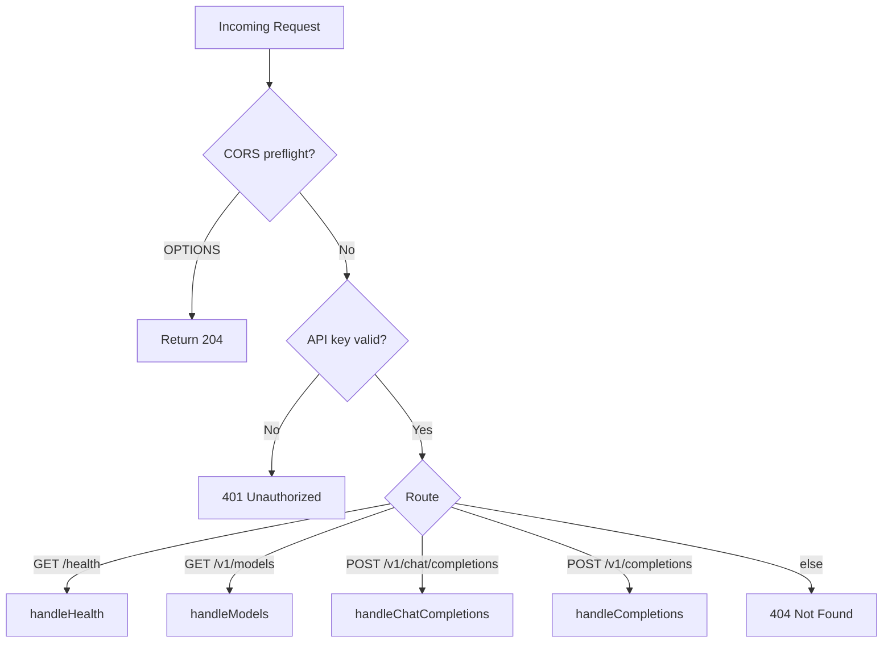
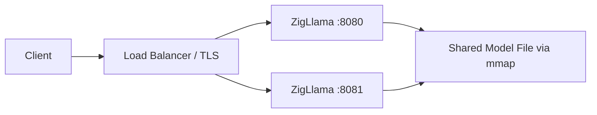

# HTTP Server

ZigLlama ships an HTTP server that exposes an **OpenAI-compatible REST API**.
Any client library that speaks the OpenAI chat-completions protocol --
`openai-python`, `langchain`, `curl` -- can target ZigLlama with zero code
changes.  The server adds ZigLlama-specific extensions for advanced sampling,
grammar-constrained decoding, and Mirostat temperature control.

---

## Server Architecture

### ServerConfig

Every tunable is captured in a single configuration struct:

```zig
pub const ServerConfig = struct {
    host: []const u8 = "127.0.0.1",
    port: u16 = 8080,
    max_connections: u32 = 100,
    timeout_seconds: u32 = 30,
    cors_enabled: bool = true,
    api_key: ?[]const u8 = null,
    max_tokens: u32 = 2048,
    enable_streaming: bool = true,
};
```

!!! info "Defaults"
    The server binds to `127.0.0.1:8080` with CORS enabled and no API key.
    Set `api_key` to a non-null value to require `Authorization: Bearer <key>`
    on every request.

### Endpoint Routing

Routing is performed via a simple method + path comparison inside
`handleRequest`.  The server recognises four endpoints:



---

## OpenAI-Compatible API

### POST /v1/chat/completions

The primary endpoint.  Accepts a JSON body conforming to `ChatCompletionRequest`:

```zig
pub const ChatCompletionRequest = struct {
    model: []const u8,
    messages: []ChatMessage,
    max_tokens: ?u32 = null,
    temperature: ?f32 = null,
    top_p: ?f32 = null,
    top_k: ?u32 = null,
    frequency_penalty: ?f32 = null,
    presence_penalty: ?f32 = null,
    stop: ?[][]const u8 = null,
    stream: ?bool = null,
    // ZigLlama extensions (see below)
    sampling_strategy: ?[]const u8 = null,
    grammar: ?[]const u8 = null,
    mirostat_tau: ?f32 = null,
    typical_mass: ?f32 = null,
};
```

Each `ChatMessage` carries a `role` (`"system"`, `"user"`, `"assistant"`) and
`content` string.  The server converts the message array into a prompt using
the auto-detected chat template (LLaMA 2, LLaMA 3, ChatML, Mistral, etc.).

#### Request Example

```json
{
  "model": "llama-7b",
  "messages": [
    {"role": "system", "content": "You are a helpful assistant."},
    {"role": "user", "content": "Explain attention in transformers."}
  ],
  "max_tokens": 256,
  "temperature": 0.7,
  "top_p": 0.9,
  "stream": false
}
```

#### Response

The response follows `ChatCompletionResponse`:

```json
{
  "id": "req_65f1a2b_0",
  "object": "chat.completion",
  "created": 1700000000,
  "model": "llama-7b",
  "choices": [
    {
      "index": 0,
      "message": {
        "role": "assistant",
        "content": "Attention allows the model to weigh..."
      },
      "finish_reason": "stop"
    }
  ],
  "usage": {
    "prompt_tokens": 24,
    "completion_tokens": 48,
    "total_tokens": 72
  }
}
```

### POST /v1/completions

Plain text completion (no chat formatting).  Accepts `CompletionRequest` with a
`prompt` field instead of `messages`:

```json
{
  "model": "llama-7b",
  "prompt": "The future of AI is",
  "max_tokens": 50,
  "temperature": 0.8
}
```

Returns a `CompletionResponse` whose `choices[].text` contains the generated
continuation.

### GET /v1/models

Lists every model the server is aware of:

```json
{
  "object": "list",
  "data": [
    {"id": "llama-7b", "object": "model", "created": 1677610602, "owned_by": "zigllama"},
    {"id": "llama-13b", "object": "model", "created": 1677610602, "owned_by": "zigllama"},
    {"id": "gpt2-124m", "object": "model", "created": 1677610602, "owned_by": "zigllama"},
    {"id": "mistral-7b", "object": "model", "created": 1677610602, "owned_by": "zigllama"}
  ]
}
```

### GET /health

Returns a lightweight health-check payload:

```json
{"status": "healthy", "service": "zigllama", "version": "1.0.0"}
```

!!! tip "Load balancer integration"
    Point your load balancer's health probe at `/health`.  The endpoint
    allocates no memory beyond the static response string and returns in
    sub-millisecond time.

---

## ZigLlama Extensions

The following fields are **not** part of the OpenAI specification and are
silently ignored by standard clients:

| Field | Type | Description |
|-------|------|-------------|
| `sampling_strategy` | `?string` | `"mirostat"` or `"typical"` -- selects an advanced sampler. |
| `grammar` | `?string` | JSON schema or regex pattern for grammar-constrained output. |
| `mirostat_tau` | `?f32` | Target surprise value for Mirostat V2 (default `3.0`). |
| `typical_mass` | `?f32` | Probability mass for Typical sampling (default `0.9`). |

!!! example "Mirostat-controlled generation"
    ```json
    {
      "model": "llama-7b",
      "messages": [{"role": "user", "content": "Write a poem."}],
      "sampling_strategy": "mirostat",
      "mirostat_tau": 5.0,
      "max_tokens": 200
    }
    ```

!!! example "Grammar-constrained JSON output"
    ```json
    {
      "model": "llama-7b",
      "messages": [{"role": "user", "content": "List 3 colours."}],
      "grammar": "{\"type\": \"array\", \"items\": {\"type\": \"string\"}}",
      "max_tokens": 100
    }
    ```

---

## Streaming via Server-Sent Events

When `"stream": true`, the server responds with `Content-Type: text/event-stream`
and writes one SSE frame per generated token:

```
data: {"id":"chatcmpl-123","object":"chat.completion.chunk","created":1677652288,
       "model":"llama-7b","choices":[{"index":0,"delta":{"role":"assistant",
       "content":"Hello"},"finish_reason":null}]}

data: {"id":"chatcmpl-123","object":"chat.completion.chunk","created":1677652288,
       "model":"llama-7b","choices":[{"index":0,"delta":{"content":" world"},
       "finish_reason":null}]}

data: [DONE]
```

!!! info "SSE protocol"
    Each frame is prefixed with `data: ` and terminated by two newlines
    (`\n\n`).  The final frame is always the literal string `data: [DONE]\n\n`.
    Headers include `Cache-Control: no-cache` and `Connection: keep-alive` to
    prevent intermediate proxies from buffering.

The `StreamChunk` and `StreamChoice` structs mirror their non-streaming
counterparts, except that `message` is replaced by `delta` containing only the
incremental content.

---

## Authentication

Authentication is optional and controlled by `ServerConfig.api_key`:

```zig
server_config.api_key = "sk-my-secret-key";
```

When set, every request must include:

```
Authorization: Bearer sk-my-secret-key
```

The server checks the header **before** routing.  A missing or invalid key
returns:

```json
{"error": {"message": "Missing or invalid authorization header", "type": "invalid_request_error", "code": 401}}
```

!!! warning "Key storage"
    Pass the API key via the `--api-key` CLI flag or an environment variable.
    Do **not** hard-code keys in source files.

---

## CORS Configuration

Cross-Origin Resource Sharing headers are injected when `cors_enabled` is
`true` (the default):

| Header | Value |
|--------|-------|
| `Access-Control-Allow-Origin` | `*` |
| `Access-Control-Allow-Methods` | `GET, POST, OPTIONS` |
| `Access-Control-Allow-Headers` | `Content-Type, Authorization` |
| `Access-Control-Max-Age` | `86400` (preflight cache) |

`OPTIONS` preflight requests are answered with an empty body and status `204`.
Disable CORS via `--no-cors` when the server sits behind a reverse proxy that
handles it.

---

## Deployment Considerations

!!! warning "Production readiness"
    ZigLlama's HTTP server is designed for educational and development use.
    For high-traffic production deployments, consider placing it behind a
    reverse proxy (NGINX, Caddy) that provides TLS termination, rate limiting,
    and connection pooling.

**Recommended architecture:**



**Key parameters for tuning:**

| Parameter | Default | Guidance |
|-----------|---------|----------|
| `max_connections` | 100 | Match to expected concurrent users. |
| `timeout_seconds` | 30 | Increase for large `max_tokens` values. |
| `max_tokens` | 2048 | Cap to prevent runaway generation. |
| `enable_streaming` | `true` | Disable only when clients do not support SSE. |

**Memory planning:**

The server's memory footprint is dominated by the loaded model.  A 7B-parameter
model in Q4_0 quantisation requires approximately 3.5 GB.  The HTTP layer adds
negligible overhead -- each in-flight request allocates at most 1 MB for the
request body and a few kilobytes for response serialisation.

---

## Source Reference

| File | Key Types |
|------|-----------|
| `src/server/http_server.zig` | `ZigLlamaServer`, `ServerConfig`, `ChatCompletionRequest`, `ChatCompletionResponse`, `StreamChunk` |
| `src/server/cli.zig` | CLI argument parser, startup banner |
