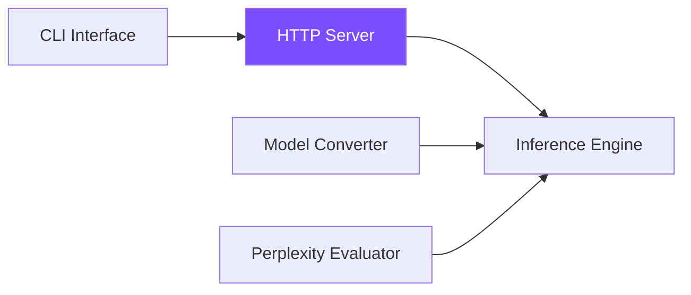

# Tools and Server

This section covers the production-oriented tooling that transforms ZigLlama
from an educational library into a deployable inference system.  Each tool is
built on top of the six foundational layers and exposes their capabilities
through ergonomic interfaces.

---

## Section Overview



| Page | Description |
|------|-------------|
| [HTTP Server](http-server.md) | OpenAI-compatible REST API with streaming, authentication, and CORS support. |
| [CLI Interface](cli.md) | Command-line launcher for the server with argument parsing, environment configuration, and interactive mode. |
| [Model Converter](model-converter.md) | Convert between PyTorch, GGUF, SafeTensors, ONNX, and TensorFlow formats with optional quantization. |
| [Perplexity Evaluation](perplexity.md) | Measure model quality using sliding-window perplexity, bits-per-token, and benchmark suites. |

---

## Quick Reference

!!! tip "Typical workflow"
    1. **Convert** a HuggingFace model to GGUF with the Model Converter.
    2. **Evaluate** quantization quality using the Perplexity Evaluator.
    3. **Serve** the model through the HTTP Server launched via the CLI.
    4. **Query** the `/v1/chat/completions` endpoint from any OpenAI-compatible client.

All tools share ZigLlama's allocation-explicit design: memory is managed through
Zig's `GeneralPurposeAllocator`, enabling deterministic cleanup and leak
detection in debug builds.

---

## Source Layout

```
src/
  server/
    http_server.zig   # ZigLlamaServer, OpenAI-compatible endpoints
    cli.zig           # Argument parsing, startup banner, help text
  tools/
    model_converter.zig   # ModelConverter, ConversionConfig, format I/O
    converter_cli.zig     # CLI wrapper for the converter
  evaluation/
    perplexity.zig        # PerplexityEvaluator, BenchmarkSuite
```
