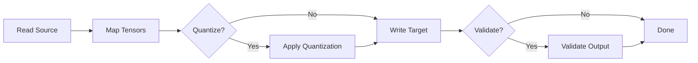

# Model Converter

The Model Converter (`src/tools/model_converter.zig`) transforms neural-network
weight files between the most common serialisation formats.  It optionally
applies quantisation during conversion, making it possible to go from a
HuggingFace SafeTensors checkpoint directly to a 4-bit GGUF file in a single
pass.

---

## Supported Formats

| Format | Extension(s) | Read | Write | Notes |
|--------|-------------|------|-------|-------|
| **PyTorch** | `.pt`, `.pth` | Experimental | -- | Requires external tensor deserialization. |
| **GGUF** | `.gguf` | Yes | Yes | Native llama.cpp-compatible format. |
| **SafeTensors** | `.safetensors` | Yes | Yes | HuggingFace standard. |
| **ONNX** | `.onnx` | Experimental | -- | Open Neural Network Exchange. |
| **TensorFlow** | `.pb` | Experimental | -- | Protocol-buffer SavedModel. |
| **Custom** | `.zigllama` | Yes | Yes | ZigLlama's own optimised layout. |

!!! info "Auto-detection"
    When `--source-format` is omitted, the converter infers the format from
    the file extension using `ModelFormat.fromExtension`.

### ModelFormat Enum

```zig
pub const ModelFormat = enum {
    PyTorch,     // .pt, .pth
    GGUF,        // .gguf
    SafeTensors, // .safetensors
    ONNX,        // .onnx
    TensorFlow,  // .pb
    Custom,      // .zigllama

    pub fn fromExtension(path: []const u8) ?ModelFormat { ... }
    pub fn toString(self: ModelFormat) []const u8 { ... }
    pub fn extension(self: ModelFormat) []const u8 { ... }
};
```

---

## ConversionConfig

All conversion parameters are captured in a single struct:

```zig
pub const ConversionConfig = struct {
    source_format: ModelFormat,
    target_format: ModelFormat,
    quantization_type: ?QuantizationType = null,
    preserve_metadata: bool = true,
    validate_output: bool = true,
    verbose: bool = false,
    chunk_size: usize = 1024 * 1024,  // 1 MB processing chunks
};
```

| Field | Purpose |
|-------|---------|
| `source_format` / `target_format` | Format pair for the conversion. |
| `quantization_type` | If set, quantise weights during conversion (see table below). |
| `preserve_metadata` | Copy architecture metadata (vocab size, context length, etc.) to the target. |
| `validate_output` | After writing, re-open the target and verify non-zero file size. |
| `chunk_size` | I/O buffer size for streaming large tensors. |

### Quantization Types

The `QuantizationType` enum covers both legacy and modern K-quant formats:

| Category | Variants |
|----------|----------|
| **Legacy** | `Q4_0`, `Q4_1`, `Q5_0`, `Q5_1`, `Q8_0` |
| **K-Quant** | `Q4_K_S`, `Q4_K_M`, `Q5_K_S`, `Q5_K_M`, `Q6_K` |
| **IQ (Importance)** | `IQ1_S`, `IQ2_XXS`, `IQ2_XS`, `IQ3_XXS`, `IQ3_XS`, `IQ4_XS` |

!!! tip "Choosing a quantisation level"
    For most use cases, `Q4_K_M` provides the best trade-off between size and
    quality.  Use `Q6_K` when perplexity must stay within 1 % of FP16, or
    `IQ2_XS` when memory is extremely constrained (e.g., edge devices).

---

## Conversion Pipeline

The `ModelConverter.convert` method executes five stages:



1. **Read Source** -- Dispatch to format-specific loader (`loadGGUF`,
   `loadSafeTensors`, `loadPyTorch`, `loadCustom`).  Each loader populates a
   `ModelData` struct containing `ModelMetadata`, a list of `TensorInfo`
   descriptors, and a raw data buffer.

2. **Map Tensors** -- Internal normalisation step that reconciles tensor names
   and data types across formats.

3. **Quantize** -- If `quantization_type` is non-null, iterate over every
   tensor, compute per-block scale factors, and pack weights into the target
   bit width.

4. **Write Target** -- Dispatch to format-specific writer (`saveGGUF`,
   `saveSafeTensors`, `saveCustom`).

5. **Validate** -- Re-open the output file and verify that it is non-empty and
   structurally sound.

### Progress Reporting

A callback-based progress API allows the caller to render a progress bar:

```zig
var converter = ModelConverter.init(allocator, config);
converter.setProgressCallback(myProgressFn);
try converter.convert("model.safetensors", "model.gguf");
```

The converter invokes the callback at each stage with a `[0.0, 1.0]` progress
float and a human-readable message.

---

## Model Metadata

Every converted model carries a `ModelMetadata` record:

```zig
pub const ModelMetadata = struct {
    architecture: []const u8,
    vocab_size: u32,
    context_length: u32,
    embedding_dim: u32,
    num_layers: u32,
    num_heads: u32,
    intermediate_size: u32,
    rope_theta: f32,
    created_by: []const u8,
    creation_time: u64,
    source_format: []const u8,
    quantization: []const u8,
    checksum: []const u8,
};
```

`ConversionUtils.validateArchitecture` performs sanity checks (non-zero
dimensions, `embedding_dim % num_heads == 0`) on the metadata before writing.

---

## CLI Usage Examples

The converter exposes a secondary CLI through `ConverterCLI`:

### Basic conversion (format auto-detected)

```bash
model_converter model.safetensors model.gguf
```

### Conversion with quantization

```bash
model_converter --quantization q4_k_m model.safetensors model.gguf
```

### Explicit formats with verbose output

```bash
model_converter \
    --source-format safetensors \
    --target-format custom \
    --verbose \
    llama-7b.safetensors llama-7b.zigllama
```

### Full help

```bash
model_converter --help
```

```
ZigLlama Model Converter

USAGE:
    model_converter [OPTIONS] <source> <target>

ARGUMENTS:
    <source>    Source model file
    <target>    Target model file

OPTIONS:
    --source-format <fmt>   Source format (gguf, safetensors, pytorch, custom)
    --target-format <fmt>   Target format (gguf, safetensors, custom)
    --quantization <type>   Quantization type (q4_0, q4_k_m, iq2_xs, etc.)
    --verbose, -v           Enable verbose output
    --help, -h              Show this help
```

---

## Utility Functions

`ConversionUtils` provides helpers that are useful beyond the converter itself:

| Function | Purpose |
|----------|---------|
| `estimateConversionTime` | Rough time estimate based on file size and format multipliers. |
| `calculateCompressionRatio` | Ratio of original to compressed size. |
| `validateArchitecture` | Sanity-check a `ModelMetadata` record. |
| `generateFingerprint` | SHA-256 hex digest for integrity verification. |
| `getSupportedConversions` | List all implemented `(from, to)` pairs. |

!!! warning "Experimental formats"
    PyTorch, ONNX, and TensorFlow readers are stub implementations.  They
    parse enough of the header to populate metadata but do not yet transfer
    tensor data.  Contributions are welcome.

---

## Source Reference

| File | Key Types |
|------|-----------|
| `src/tools/model_converter.zig` | `ModelConverter`, `ConversionConfig`, `ModelFormat`, `QuantizationType`, `ModelMetadata`, `TensorInfo`, `ConversionUtils` |
| `src/tools/converter_cli.zig` | `ConverterCLI` CLI entry point |
