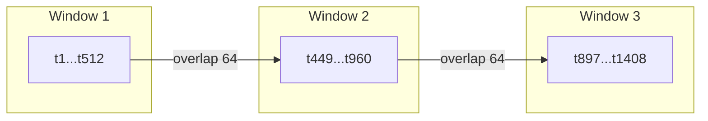

# Perplexity Evaluation

Perplexity is the standard intrinsic metric for language models.  ZigLlama's
evaluation module (`src/evaluation/perplexity.zig`) provides a configurable
evaluator, a sliding-window strategy for sequences that exceed the model's
context length, and a benchmark suite for comparing quantisation levels.

---

## What is Perplexity

Given a sequence of $N$ tokens $x_1, x_2, \ldots, x_N$, perplexity is defined
as:

$$
\text{PPL} = \exp\!\left(-\frac{1}{N}\sum_{i=1}^{N} \log p(x_i \mid x_{<i})\right)
$$

Intuitively, perplexity measures how "surprised" the model is by the data.
Lower perplexity means the model assigns higher probability to the observed
tokens.

!!! info "Relationship to cross-entropy"
    The exponent is the average negative log-likelihood, which equals the
    cross-entropy $H$ between the true data distribution and the model.
    Perplexity is therefore $2^{H}$ when logarithms are base-2, or $e^{H}$
    for natural logarithms.

Related metrics computed alongside perplexity:

| Metric | Formula | Interpretation |
|--------|---------|----------------|
| Log-perplexity | $-\frac{1}{N}\sum \log p(x_i \mid x_{<i})$ | Numerically stable form; used internally. |
| Bits per token (BPT) | $\text{log-PPL} / \ln 2$ | Information cost per token in bits. |
| Bits per character (BPC) | $\text{BPT} \times N_{\text{tokens}} / N_{\text{chars}}$ | Normalises across tokenisers. |

---

## PerplexityConfig

```zig
pub const PerplexityConfig = struct {
    max_sequence_length: usize = 2048,
    batch_size: usize = 1,
    sliding_window: usize = 512,
    window_overlap: usize = 64,
    use_log_probs: bool = true,
    temperature: f32 = 1.0,
    normalize_probs: bool = true,
    verbose: bool = false,
};
```

| Parameter | Default | Purpose |
|-----------|---------|---------|
| `max_sequence_length` | 2048 | Sequences shorter than this are evaluated in one pass. |
| `batch_size` | 1 | Number of sequences processed in parallel. |
| `sliding_window` | 512 | Window width for long-sequence evaluation. |
| `window_overlap` | 64 | Tokens shared between consecutive windows. |
| `temperature` | 1.0 | Applied to logits before softmax. Keep at 1.0 for standard perplexity. |

!!! warning "Temperature and perplexity"
    Setting `temperature != 1.0` distorts the probability distribution and
    makes perplexity values incomparable across runs.  Always use `1.0` for
    benchmarking.

---

## PerplexityResult

Every evaluation returns a `PerplexityResult`:

```zig
pub const PerplexityResult = struct {
    perplexity: f64,
    log_perplexity: f64,
    bits_per_char: f64,
    bits_per_token: f64,
    total_tokens: usize,
    total_chars: usize,
    token_log_probs: []f64,
    sequence_perplexities: []f64,
    evaluation_time_ms: u64,
    peak_memory_usage: usize,
};
```

The `token_log_probs` array stores the per-position log-probability, enabling
fine-grained analysis (e.g., identifying passages where the model struggles).
`sequence_perplexities` is populated when evaluating a multi-sequence dataset.

---

## Sliding Window Evaluation

When a token sequence exceeds `max_sequence_length`, the evaluator switches to
a sliding-window strategy:



1. The first window spans positions $[0, W)$ where $W$ = `sliding_window`.
2. Each subsequent window advances by $W - O$ positions ($O$ = `window_overlap`).
3. Within each window, log-probabilities are computed via a full forward pass.
4. Tokens in the overlap region are **discarded** from the second window to
   avoid double-counting.  Only positions in the non-overlapping suffix
   contribute to the aggregate.

The overlap ensures that every token has sufficient left-context for accurate
prediction, even at window boundaries.

!!! tip "Choosing window parameters"
    - Set `sliding_window` close to the model's training context length for
      maximum accuracy.
    - An `overlap` of 64--128 tokens is usually sufficient for stable boundary
      transitions.

---

## Interpreting Results

### What is "good" perplexity?

Perplexity depends on the vocabulary, tokeniser, dataset, and model size.
The following table gives rough baselines on WikiText-103 for common model
sizes:

| Model Size | FP16 PPL | Q4_K_M PPL | Q8_0 PPL |
|-----------|----------|------------|----------|
| 7B | ~5.7 | ~5.9 | ~5.7 |
| 13B | ~5.1 | ~5.3 | ~5.1 |
| 30B | ~4.3 | ~4.5 | ~4.3 |
| 65B | ~3.5 | ~3.7 | ~3.5 |

!!! info "Absolute vs. relative"
    Absolute perplexity varies wildly across datasets (news articles might
    yield PPL 15 while code yields PPL 3).  Compare models on the **same
    dataset** and focus on **relative** differences.

### Degradation thresholds

| Degradation | Verdict |
|-------------|---------|
| < 1 % | Negligible -- quantisation is lossless for practical purposes. |
| 1--5 % | Acceptable for most applications. |
| 5--15 % | Noticeable quality loss; consider a higher-bit quantisation. |
| > 15 % | Severe -- avoid for tasks requiring factual accuracy. |

---

## Benchmarking Quantisation Quality

A typical quantisation-quality workflow:

```zig
const std = @import("std");
const perplexity = @import("evaluation/perplexity.zig");

// 1. Evaluate FP16 baseline
var config = perplexity.PerplexityConfig{ .verbose = true };
var evaluator = perplexity.PerplexityEvaluator.init(
    allocator, config, model_fp16, tokenizer,
);
const baseline = try evaluator.evaluateDataset(wiki_dataset);

// 2. Evaluate Q4_K_M
var evaluator_q4 = perplexity.PerplexityEvaluator.init(
    allocator, config, model_q4km, tokenizer,
);
const q4_result = try evaluator_q4.evaluateDataset(wiki_dataset);

// 3. Compare
const comparison = perplexity.PerplexityUtils.compareResults(
    baseline, q4_result,
);
std.log.info("Relative degradation: {d:.2f}%",
    .{comparison.relative_difference * 100});
```

The `PerplexityComparison` struct returned by `compareResults` reports:

| Field | Type | Description |
|-------|------|-------------|
| `absolute_difference` | `f64` | $\text{PPL}_1 - \text{PPL}_2$ |
| `relative_difference` | `f64` | $(\text{PPL}_1 - \text{PPL}_2) / \text{PPL}_2$ |
| `is_statistically_significant` | `bool` | `true` if relative difference exceeds 5 %. |
| `better_result` | enum | `.First` or `.Second`. |

### Benchmark Suite

For systematic evaluation across multiple datasets, use `BenchmarkSuite`:

```zig
var suite = perplexity.BenchmarkSuite.init(allocator, evaluator);
defer suite.deinit();

// Add standard benchmarks
try suite.generateSyntheticDataset("synthetic-small", 100, 256);
try suite.generateSyntheticDataset("synthetic-large", 50, 1024);

// Run all benchmarks
var results = try suite.runBenchmark();
defer results.deinit(allocator);

results.printReport();
try results.saveToFile("benchmark_results.json", allocator);
```

The suite supports the following standard benchmark identifiers via
`StandardBenchmarks`:

- `WIKITEXT_103`
- `PENN_TREEBANK`
- `LAMBADA`
- `HELLASWAG`
- `SYNTHETIC_SMALL` / `SYNTHETIC_LARGE`

---

## Confidence Intervals

`PerplexityUtils.calculateConfidenceInterval` computes percentile-based
confidence bounds over per-sequence perplexity values:

```zig
const ci = PerplexityUtils.calculateConfidenceInterval(
    result.sequence_perplexities, 0.95,
);
std.log.info("95% CI: [{d:.2f}, {d:.2f}]", .{ ci.lower, ci.upper });
```

This is particularly useful when comparing two quantisation levels: if their
95 % confidence intervals overlap, the difference is likely not meaningful.

---

## Source Reference

| File | Key Types |
|------|-----------|
| `src/evaluation/perplexity.zig` | `PerplexityEvaluator`, `PerplexityConfig`, `PerplexityResult`, `BenchmarkSuite`, `BenchmarkResults`, `PerplexityUtils`, `StandardBenchmarks` |
| `examples/perplexity_demo.zig` | End-to-end demo of configuration, evaluation, and reporting |
