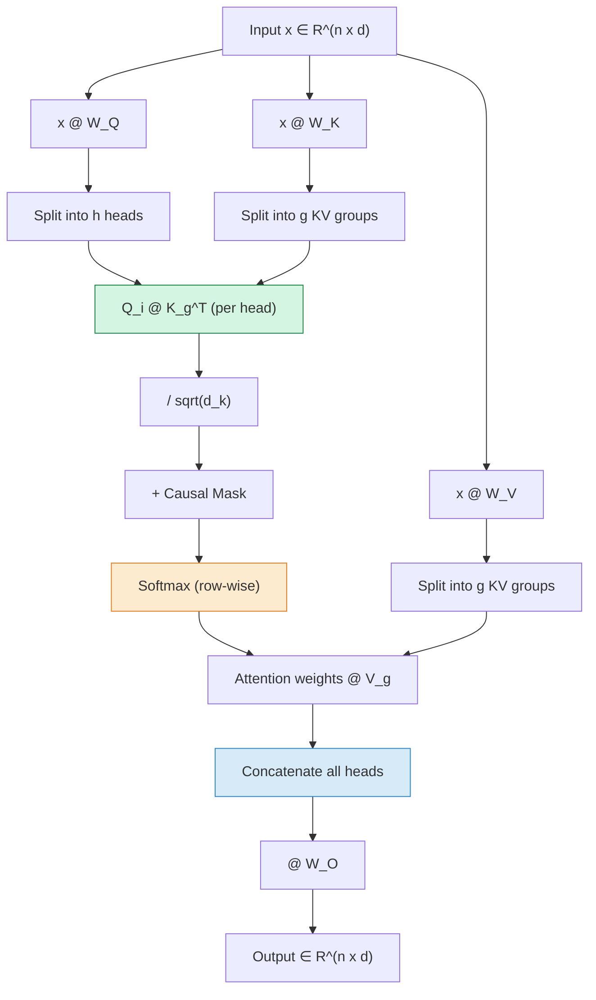

# Attention Mechanisms

Attention is the defining innovation of the transformer architecture.  It
allows every position in a sequence to *directly* interact with every other
position in a single operation, replacing the sequential processing of RNNs
with a fully parallel computation.  This page provides a thorough, from-first-
principles treatment of every attention variant used in modern LLMs.

---

## 1. Intuition: Attention as Soft Dictionary Lookup

Before diving into formulas, consider a simple analogy.  A **dictionary**
maps keys to values: given a query, find the matching key and return its value.
Attention generalizes this to *soft* matching:

1. **Query** (\(q\)): "What am I looking for?"
2. **Keys** (\(k_1, \ldots, k_n\)): "What does each position offer?"
3. **Values** (\(v_1, \ldots, v_n\)): "What information does each position carry?"
4. **Score** (\(s_i = q^\top k_i\)): "How well does position \(i\) match my query?"
5. **Output** (\(\sum_i \alpha_i v_i\)): "Weighted aggregation of all values."

The weights \(\alpha_i = \operatorname{softmax}(s_i)\) are *soft* -- every
position contributes, but positions with higher alignment contribute more.

---

## 2. Scaled Dot-Product Attention

### 2.1 Definition

!!! definition "Scaled Dot-Product Attention"

    For queries \(Q \in \mathbb{R}^{n \times d_k}\), keys
    \(K \in \mathbb{R}^{n \times d_k}\), and values
    \(V \in \mathbb{R}^{n \times d_v}\):

    \[
        \operatorname{Attention}(Q, K, V) =
        \operatorname{softmax}\!\left(\frac{Q K^\top}{\sqrt{d_k}}\right) V
    \]

### 2.2 Why Scale by \(\sqrt{d_k}\)?

!!! theorem "Variance of Dot Products"

    If the elements of \(q\) and \(k\) are independent random variables with
    mean 0 and variance 1, then:

    \[
        \operatorname{Var}(q^\top k) = \operatorname{Var}\!\left(\sum_{i=1}^{d_k} q_i k_i\right) = d_k
    \]

    **Proof.** Each \(q_i k_i\) has \(\mathbb{E}[q_i k_i] = 0\) and
    \(\operatorname{Var}(q_i k_i) = \mathbb{E}[q_i^2]\mathbb{E}[k_i^2] = 1\).
    Independence gives \(\operatorname{Var}(\sum q_i k_i) = d_k\).  \(\square\)

Without scaling, the logits \(QK^\top\) have standard deviation \(\sqrt{d_k}\).
For \(d_k = 128\), this means logits are on the order of \(\pm 11\), which
pushes softmax deep into saturation.  In the saturated regime:

- The output is nearly one-hot (attending to a single position).
- Gradients are near zero, stalling learning.

Dividing by \(\sqrt{d_k}\) normalizes the logits to \(O(1)\) variance,
keeping softmax in a regime with informative gradients.

### 2.3 Algorithm

!!! algorithm "Scaled Dot-Product Attention"

    **Input:** \(Q, K \in \mathbb{R}^{n \times d_k},\; V \in \mathbb{R}^{n \times d_v}\)

    1. Compute scores: \(S = QK^\top \in \mathbb{R}^{n \times n}\)
    2. Scale: \(S \leftarrow S / \sqrt{d_k}\)
    3. (Optional) Apply mask: \(S_{ij} \leftarrow -\infty\) where masked
    4. Normalize: \(A = \operatorname{softmax}(S)\) row-wise
    5. Aggregate: \(\text{output} = AV \in \mathbb{R}^{n \times d_v}\)

    **Output:** Weighted value vectors

---

## 3. Multi-Head Attention (MHA)

### 3.1 Definition

!!! definition "Multi-Head Attention (Vaswani et al. 2017)"

    \[
        \operatorname{MultiHead}(Q, K, V) =
        \operatorname{Concat}(\text{head}_1, \ldots, \text{head}_h)\, W^O
    \]

    where each head is:

    \[
        \text{head}_i = \operatorname{Attention}(Q W_i^Q,\; K W_i^K,\; V W_i^V)
    \]

    with \(W_i^Q, W_i^K \in \mathbb{R}^{d \times d_k}\),
    \(W_i^V \in \mathbb{R}^{d \times d_v}\),
    \(W^O \in \mathbb{R}^{hd_v \times d}\),
    and typically \(d_k = d_v = d/h\).[^1]

### 3.2 Why Multiple Heads?

Each head operates on a different learned subspace, allowing the model to
simultaneously attend to:

- Syntactic relationships (e.g., subject-verb agreement)
- Semantic similarity (e.g., synonyms)
- Positional patterns (e.g., nearby tokens)
- Long-range dependencies (e.g., coreference)

Empirically, reducing to a single head consistently degrades model quality,
even when the total parameter count is held constant.

### 3.3 Parameter Count

For a model with dimension \(d\) and \(h\) heads:

| Matrix | Shape | Parameters |
|---|---|---|
| \(W^Q\) (all heads combined) | \(d \times d\) | \(d^2\) |
| \(W^K\) | \(d \times d\) | \(d^2\) |
| \(W^V\) | \(d \times d\) | \(d^2\) |
| \(W^O\) | \(d \times d\) | \(d^2\) |
| **Total** | | \(4d^2\) |

---

## 4. Grouped-Query Attention (GQA)

!!! definition "GQA (Ainslie et al. 2023)"

    In GQA, the \(h\) query heads share \(g\) groups of key-value heads, where
    \(1 < g < h\).  Each group of \(h/g\) query heads shares a single K and
    V projection.[^2]

    \[
        \text{head}_i = \operatorname{Attention}\!\left(
            Q W_i^Q,\;
            K W_{\lfloor ig/h \rfloor}^K,\;
            V W_{\lfloor ig/h \rfloor}^V
        \right)
    \]

**KV cache savings.**  With standard MHA, the KV cache stores
\(2 \times h \times d_k\) values per position per layer.  With GQA using
\(g\) groups, this reduces to \(2 \times g \times d_k\) -- a factor of
\(h/g\) reduction.

| Model | Heads (\(h\)) | KV Groups (\(g\)) | KV Cache Reduction |
|---|---|---|---|
| LLaMA 2 70B | 64 | 8 | 8x |
| Mistral 7B | 32 | 8 | 4x |
| CodeLlama 34B | 64 | 8 | 8x |

---

## 5. Multi-Query Attention (MQA)

!!! definition "MQA (Shazeer 2019)"

    MQA is the extreme case of GQA where **all** query heads share a single
    key head and a single value head (\(g = 1\)):[^3]

    \[
        \text{head}_i = \operatorname{Attention}(Q W_i^Q,\; K W^K,\; V W^V)
    \]

**Advantages:** Maximum KV cache compression; only \(2 d_k\) values per
position per layer.

**Disadvantage:** Some quality loss compared to full MHA, especially for
complex reasoning tasks.

| Model | Architecture |
|---|---|
| Falcon 40B | MQA |
| StarCoder | MQA |
| PaLM (initial) | MQA |

---

## 6. Sliding Window Attention

!!! definition "Sliding Window Attention (Mistral)"

    Each token attends only to the \(W\) most recent tokens (a local window),
    rather than the full context.  At layer \(\ell\), the effective receptive
    field is \(\ell \times W\) tokens due to information propagation through
    stacked layers.

    \[
        \operatorname{Attention}_{i}(Q, K, V) =
        \operatorname{softmax}\!\left(\frac{q_i k_{[i-W:i]}^\top}{\sqrt{d_k}}\right) v_{[i-W:i]}
    \]

!!! complexity "Sliding Window Complexity"

    | Metric | Full Attention | Sliding Window |
    |---|---|---|
    | Time | \(O(n^2 d)\) | \(O(n \cdot W \cdot d)\) |
    | Memory (scores) | \(O(n^2)\) | \(O(n \cdot W)\) |

    For Mistral with \(W = 4096\) and context length \(n = 32768\), this is
    an 8x reduction in attention computation.

---

## 7. Causal Masking

### 7.1 Purpose

In autoregressive (decoder) models, the token at position \(i\) must not
attend to any future position \(j > i\).  This is enforced by a **causal mask**
-- a lower-triangular matrix of zeros with \(-\infty\) above the diagonal.

!!! definition "Causal Mask"

    \[
        M_{ij} =
        \begin{cases}
            0 & \text{if } j \leq i \\
            -\infty & \text{if } j > i
        \end{cases}
    \]

    Applied to attention scores: \(\operatorname{softmax}(QK^\top / \sqrt{d_k} + M)\).
    The \(-\infty\) entries become zero after softmax.

### 7.2 Mask Pattern

```
Position:  0  1  2  3
     0  [  0 -inf -inf -inf ]    (sees only itself)
     1  [  0   0  -inf -inf ]    (sees 0 and 1)
     2  [  0   0    0  -inf ]    (sees 0, 1, 2)
     3  [  0   0    0    0  ]    (sees all)
```

---

## 8. Bidirectional Attention

BERT-style encoder models use **full attention** without causal masking: every
position can attend to every other position.  This is appropriate for
understanding tasks (classification, extraction) but prevents autoregressive
generation.

---

## 9. Complexity Analysis

!!! complexity "Attention Computational Complexity"

    For sequence length \(n\), model dimension \(d\), and \(d_k = d/h\):

    | Operation | Time | Space |
    |---|---|---|
    | Q, K, V projections | \(O(n d^2)\) | \(O(nd)\) |
    | Score matrix \(QK^\top\) | \(O(n^2 d_k)\) per head, \(O(n^2 d)\) total | \(O(n^2 h) = O(n^2 h)\) |
    | Softmax | \(O(n^2 h)\) | \(O(n^2 h)\) |
    | Value aggregation \(AV\) | \(O(n^2 d_v)\) per head, \(O(n^2 d)\) total | \(O(nd)\) |
    | Output projection | \(O(nd^2)\) | \(O(nd)\) |
    | **Total** | \(O(n^2 d + n d^2)\) | \(O(n^2 + nd)\) |

    For long sequences (\(n \gg d\)), the \(n^2\) term dominates both time
    and space.  This is the fundamental bottleneck that sliding window
    attention, sparse attention, and linear attention aim to address.

---

## 10. Attention Computation Flow



---

## 11. Implementation in ZigLlama

### 11.1 MultiHeadAttention Struct

```zig
pub const MultiHeadAttention = struct {
    num_heads: usize,
    d_model: usize,
    d_k: usize,          // d_model / num_heads
    d_v: usize,

    w_q: Tensor(f32),    // [d_model x d_model]
    w_k: Tensor(f32),    // [d_model x d_model]
    w_v: Tensor(f32),    // [d_model x d_model]
    w_o: Tensor(f32),    // [d_model x d_model]

    allocator: Allocator,

    pub fn init(allocator: Allocator, d_model: usize, num_heads: usize) !MultiHeadAttention {
        if (d_model % num_heads != 0) return TensorError.IncompatibleShapes;
        const d_k = d_model / num_heads;
        // Initialize Q, K, V, O projection matrices with Xavier scaling
        // ...
        return MultiHeadAttention{
            .num_heads = num_heads,
            .d_model = d_model,
            .d_k = d_k,
            .d_v = d_k,
            .w_q = w_q, .w_k = w_k, .w_v = w_v, .w_o = w_o,
            .allocator = allocator,
        };
    }
};
```

### 11.2 Forward Pass

```zig
pub fn forward(
    self: *const MultiHeadAttention,
    query: Tensor(f32),   // [batch, seq_len, d_model]
    key: Tensor(f32),
    value: Tensor(f32),
    mask: ?Tensor(f32),
) !Tensor(f32) {
    // Step 1: Linear projections
    var Q = try query.matmul(self.w_q, self.allocator);
    var K = try key.matmul(self.w_k, self.allocator);
    var V = try value.matmul(self.w_v, self.allocator);

    // Step 2: Reshape [batch, seq, d_model] -> [batch, heads, seq, d_k]
    var Q_heads = try reshapeForHeads(Q, ...);
    var K_heads = try reshapeForHeads(K, ...);
    var V_heads = try reshapeForHeads(V, ...);

    // Step 3: Scaled dot-product attention per head
    var attn_out = try scaledDotProductAttention(Q_heads, K_heads, V_heads, mask, self.allocator);

    // Step 4: Concatenate heads -> [batch, seq, d_model]
    var concat = try reshapeFromHeads(attn_out, ...);

    // Step 5: Output projection
    return try concat.matmul(self.w_o, self.allocator);
}
```

### 11.3 Scaled Dot-Product Attention

```zig
pub fn scaledDotProductAttention(
    Q: Tensor(f32),    // [batch, heads, seq_q, d_k]
    K: Tensor(f32),    // [batch, heads, seq_k, d_k]
    V: Tensor(f32),    // [batch, heads, seq_k, d_v]
    mask: ?Tensor(f32),
    allocator: Allocator,
) !Tensor(f32) {
    const d_k = Q.shape[3];

    // 1. QK^T via batched matmul (transpose K)
    var scores = try batchedMatMul(Q, K, allocator, true);

    // 2. Scale
    const scale = 1.0 / @sqrt(@as(f32, @floatFromInt(d_k)));
    for (0..scores.size) |i| scores.data[i] *= scale;

    // 3. Mask (set future positions to -inf)
    if (mask) |m| try applyMask(&scores, m);

    // 4. Softmax (numerically stable, per row)
    var weights = try softmaxLastDim(scores, allocator);

    // 5. Weighted aggregation
    return try batchedMatMul(weights, V, allocator, false);
}
```

### 11.4 Causal Mask Creation

```zig
pub fn createCausalMask(allocator: Allocator, seq_len: usize) !Tensor(f32) {
    var mask = try Tensor(f32).init(allocator, &[_]usize{ seq_len, seq_len });
    for (0..seq_len) |i| {
        for (0..seq_len) |j| {
            try mask.set(&[_]usize{ i, j }, if (j <= i) 0.0 else -math.inf(f32));
        }
    }
    return mask;
}
```

### 11.5 RoPE Integration

ZigLlama applies Rotary Position Embeddings to Q and K after the linear
projections but before the dot-product computation:

```zig
pub fn applyRotaryEncoding(
    queries: Tensor(f32),
    keys: Tensor(f32),
    seq_len: usize,
    allocator: Allocator,
) !struct { q: Tensor(f32), k: Tensor(f32) } {
    const rotated_q = try applyRoPE(queries, seq_len, allocator);
    const rotated_k = try applyRoPE(keys, seq_len, allocator);
    return .{ .q = rotated_q, .k = rotated_k };
}
```

!!! info "Source File"

    Full implementation: `src/transformers/attention.zig`
    (approximately 650 lines including batched matmul, softmax, masking,
    and RoPE helpers).

---

## 12. Attention Variant Summary

| Variant | KV Heads per Layer | KV Cache Size | Quality | Inference Speed | Models |
|---|---|---|---|---|---|
| MHA | \(h\) | \(2hd_k \cdot n\) | Baseline | Baseline | GPT-3, BERT |
| GQA (\(g\) groups) | \(g\) | \(2gd_k \cdot n\) | ~Baseline | Faster | LLaMA 2, Mistral |
| MQA | 1 | \(2d_k \cdot n\) | Slight loss | Fastest | Falcon, StarCoder |
| Sliding Window | \(h\) (windowed) | \(2hd_k \cdot W\) | ~Baseline (stacked) | Faster for long \(n\) | Mistral |

---

## 13. Exercises

1. **Compute** the number of floating-point operations for a single attention
   layer with \(n = 2048\), \(d = 4096\), \(h = 32\).
2. **Show** that when \(g = h\), GQA reduces to standard MHA, and when
   \(g = 1\), it reduces to MQA.
3. **Implement** a simple GQA modification to `MultiHeadAttention` by
   broadcasting shared K/V heads across query groups.
4. **Derive** the gradient of the attention output with respect to the query
   matrix \(Q\) (useful for understanding training dynamics).
5. **Calculate** the KV cache memory for Mistral 7B (32 layers, 32 heads,
   8 KV groups, \(d_k = 128\), context 8192) in bytes at `f16`.

---

## References

[^1]: Vaswani, A. et al. "Attention Is All You Need." *NeurIPS*, 2017.
[^2]: Ainslie, J. et al. "GQA: Training Generalized Multi-Query Transformer Models from Multi-Head Checkpoints." *EMNLP*, 2023.
[^3]: Shazeer, N. "Fast Transformer Decoding: One Write-Head is All You Need." *arXiv:1911.02150*, 2019.
[^4]: Jiang, A. Q. et al. "Mistral 7B." *arXiv:2310.06825*, 2023.
[^5]: Dao, T. et al. "FlashAttention: Fast and Memory-Efficient Exact Attention with IO-Awareness." *NeurIPS*, 2022.
