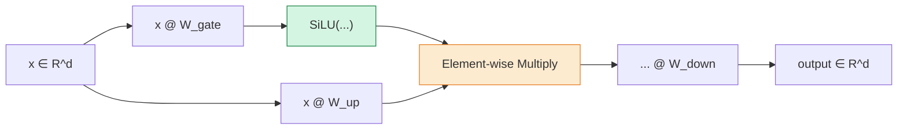
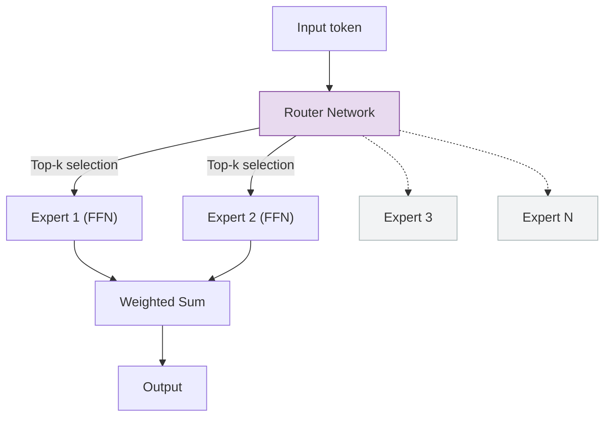

# Feed-Forward Networks

Every transformer block contains a **feed-forward network** (FFN) applied
independently to each position in the sequence.  While attention allows
positions to communicate, the FFN is where the model performs its per-position
*processing* -- transforming representations through a non-linear bottleneck.
In modern LLMs, FFN layers hold approximately **two-thirds** of all per-layer
parameters, making them the largest single component of the model.

---

## 1. Role in Transformers

### 1.1 Position-Wise Processing

!!! info "Position Independence"

    The FFN applies the **same** transformation to every position in the
    sequence, with no interaction between positions:

    \[
        \text{FFN}(X)_i = f(X_i) \quad \text{for } i = 1, \ldots, n
    \]

    This is in contrast to attention, which mixes information across all
    positions.  The FFN's job is to *process* the information that attention
    has gathered.

The position-wise property makes FFNs embarrassingly parallel across the
sequence dimension -- every position can be computed independently, which is
ideal for GPU/SIMD execution.

### 1.2 The Two Halves of a Transformer Block

A transformer block alternates between two types of computation:

1. **Attention:** *What information is relevant?*  (inter-position mixing)
2. **FFN:** *How should I transform this information?*  (per-position processing)

This alternation is repeated \(L\) times, with residual connections ensuring
information can flow directly from early to late layers.

---

## 2. Standard FFN (Original Transformer)

!!! definition "Standard Feed-Forward Network"

    \[
        \text{FFN}(x) = \sigma(x W_1 + b_1)\, W_2 + b_2
    \]

    where \(W_1 \in \mathbb{R}^{d \times d_{ff}}\),
    \(W_2 \in \mathbb{R}^{d_{ff} \times d}\), and \(\sigma\) is the
    activation function (ReLU in the original paper).[^1]

The standard FFN is a two-layer MLP with a hidden dimension \(d_{ff}\) that is
larger than the model dimension \(d\).  The expansion to \(d_{ff}\) followed by
compression back to \(d\) creates an information bottleneck that forces the
network to learn useful intermediate representations.

**Convention:** \(d_{ff} = 4\, d_{\text{model}}\).

| Parameter | Shape | Count |
|---|---|---|
| \(W_1\) | \(d \times d_{ff}\) | \(d \cdot d_{ff}\) |
| \(W_2\) | \(d_{ff} \times d\) | \(d_{ff} \cdot d\) |
| **Total** | | \(2\, d \cdot d_{ff} = 8\, d^2\) (with \(d_{ff} = 4d\)) |

---

## 3. SwiGLU FFN (LLaMA Architecture)

### 3.1 Definition

!!! definition "SwiGLU Feed-Forward Network"

    \[
        \text{FFN}_{\text{SwiGLU}}(x) =
        \bigl(\operatorname{SiLU}(x\, W_{\text{gate}})\bigr) \odot
        \bigl(x\, W_{\text{up}}\bigr)\; W_{\text{down}}
    \]

    where \(W_{\text{gate}}, W_{\text{up}} \in \mathbb{R}^{d \times d_{ff}}\)
    and \(W_{\text{down}} \in \mathbb{R}^{d_{ff} \times d}\).[^2]

### 3.2 The Three Matrices

Unlike the standard FFN with two weight matrices, SwiGLU uses **three**:

| Matrix | Role | Shape |
|---|---|---|
| \(W_{\text{gate}}\) | Gate projection (passed through SiLU) | \(d \times d_{ff}\) |
| \(W_{\text{up}}\) | Up projection (content stream) | \(d \times d_{ff}\) |
| \(W_{\text{down}}\) | Down projection (output compression) | \(d_{ff} \times d\) |

### 3.3 Computation Flow



### 3.4 Intuition: Why Gating Helps

The gating mechanism allows the network to learn *which* features to activate.
The gate stream \(\operatorname{SiLU}(xW_{\text{gate}})\) produces values in
\(\approx(-0.28, +\infty)\) that modulate the content stream \(xW_{\text{up}}\)
element-wise.  This is more expressive than applying a single activation to
the entire hidden representation.

---

## 4. GeGLU FFN

!!! definition "GeGLU Feed-Forward Network"

    \[
        \text{FFN}_{\text{GeGLU}}(x) =
        \bigl(\operatorname{GELU}(x\, W_{\text{gate}})\bigr) \odot
        \bigl(x\, W_{\text{up}}\bigr)\; W_{\text{down}}
    \]

GeGLU is identical to SwiGLU except that the gate activation is GELU instead
of SiLU.  The two variants perform comparably; choice is typically dictated by
consistency with the rest of the architecture.

---

## 5. Hidden Dimension Sizing

### 5.1 Standard FFN: \(d_{ff} = 4\, d_{\text{model}}\)

The original Transformer used a 4:1 ratio, giving each FFN layer \(8d^2\)
parameters.  This was found empirically to provide a good trade-off between
model capacity and computational cost.

### 5.2 SwiGLU: \(d_{ff} = \frac{8}{3}\, d_{\text{model}}\)

!!! algorithm "Matching Parameter Counts"

    The standard FFN has \(2 \cdot d \cdot d_{ff}^{\text{std}} = 8d^2\)
    parameters (with \(d_{ff}^{\text{std}} = 4d\)).

    The SwiGLU FFN has \(3 \cdot d \cdot d_{ff}^{\text{gated}}\) parameters.
    Setting these equal:

    \[
        3\, d \cdot d_{ff}^{\text{gated}} = 2\, d \cdot d_{ff}^{\text{std}}
    \]

    \[
        d_{ff}^{\text{gated}} = \frac{2}{3}\, d_{ff}^{\text{std}} = \frac{2}{3} \cdot 4d = \frac{8}{3}\, d
    \]

    In practice, \(d_{ff}\) is often rounded to the nearest multiple of 256
    for hardware alignment.

For LLaMA-7B with \(d = 4096\):

\[
    d_{ff} = \frac{8}{3} \times 4096 = 10922.67 \approx 11008 \;\text{(rounded)}
\]

---

## 6. Parameter Distribution

### 6.1 FFN Dominance

!!! complexity "Per-Layer Parameter Breakdown"

    For a standard transformer block with \(d_{ff} = 4d\):

    | Component | Parameters | Fraction |
    |---|---|---|
    | Attention (Q, K, V, O) | \(4d^2\) | 33.3% |
    | FFN (W1, W2) | \(8d^2\) | **66.7%** |
    | Normalization | \(\sim 4d\) | ~0% |
    | **Total** | \(12d^2 + O(d)\) | 100% |

    For a SwiGLU block with \(d_{ff} = \frac{8}{3}d\):

    | Component | Parameters | Fraction |
    |---|---|---|
    | Attention (Q, K, V, O) | \(4d^2\) | 33.3% |
    | FFN (gate, up, down) | \(8d^2\) | **66.7%** |
    | Normalization | \(\sim 2d\) (RMSNorm, no bias) | ~0% |
    | **Total** | \(12d^2 + O(d)\) | 100% |

The parameter count is identical by design (the SwiGLU hidden dimension was
chosen to match).  The difference is that SwiGLU allocates those parameters
across three matrices with gating, which empirically yields better quality.

### 6.2 FLOPs per Token

For a single FFN forward pass:

| Variant | Matrix Multiplies | FLOPs/token |
|---|---|---|
| Standard | 2 | \(2 \times 2 \times d \times d_{ff} = 16 d^2\) |
| SwiGLU | 3 | \(3 \times 2 \times d \times d_{ff} = 16 d^2\) |

The per-token FLOP count is the same because SwiGLU compensates with a smaller
\(d_{ff}\).

---

## 7. Comparison Table

| Variant | Matrices | \(d_{ff}\) | Activation | Parameters | Quality | Models |
|---|---|---|---|---|---|---|
| Standard (ReLU) | 2 | \(4d\) | ReLU | \(8d^2\) | Baseline | Original Transformer |
| GELU | 2 | \(4d\) | GELU | \(8d^2\) | Better | BERT, GPT-2, GPT-3 |
| SwiGLU | 3 | \(\frac{8}{3}d\) | SiLU (gate) | \(8d^2\) | Best | LLaMA, LLaMA 2, Mistral |
| GeGLU | 3 | \(\frac{8}{3}d\) | GELU (gate) | \(8d^2\) | ~Best | Some T5 variants |
| GLU | 3 | \(\frac{8}{3}d\) | Sigmoid (gate) | \(8d^2\) | Good | Older research |

---

## 8. Mixture of Experts (MoE) -- Brief Extension

ZigLlama also implements an `ExpertFFN` for Mixture of Experts models, where
multiple FFN "experts" exist per layer and a routing network selects which
expert(s) process each token.



Each expert is a standard `FeedForward` instance.  The router produces
softmax-normalized weights, and only the top-\(k\) experts (typically \(k=2\))
are activated per token, keeping compute constant while scaling model capacity.

---

## 9. Implementation in ZigLlama

### 9.1 FFNType Enum

```zig
pub const FFNType = enum {
    Standard,   // Linear -> ReLU -> Linear
    GELU,       // Linear -> GELU -> Linear
    SwiGLU,     // SwiGLU gated activation (LLaMA)
    GeGLU,      // GeGLU gated activation
    GLU,        // Classic GLU (sigmoid gate)
};
```

### 9.2 FeedForward Struct

```zig
pub const FeedForward = struct {
    ffn_type: FFNType,
    d_model: usize,
    d_ff: usize,

    w1: Tensor(f32),       // [d_model x d_ff]  (gate for gated variants)
    w2: Tensor(f32),       // [d_ff x d_model]   (down projection)
    w3: ?Tensor(f32),      // [d_model x d_ff]  (up projection, gated only)

    allocator: Allocator,

    pub fn init(allocator: Allocator, d_model: usize, d_ff: usize, ffn_type: FFNType) !FeedForward {
        var w1 = try Tensor(f32).init(allocator, &[_]usize{ d_model, d_ff });
        var w2 = try Tensor(f32).init(allocator, &[_]usize{ d_ff, d_model });
        var w3: ?Tensor(f32) = null;

        // Gated variants need a third weight matrix
        if (ffn_type == .SwiGLU or ffn_type == .GeGLU or ffn_type == .GLU) {
            w3 = try Tensor(f32).init(allocator, &[_]usize{ d_model, d_ff });
        }
        // ... Xavier initialization ...
        return FeedForward{ .ffn_type = ffn_type, .d_model = d_model, ... };
    }
};
```

### 9.3 SwiGLU Forward Pass

```zig
fn forwardSwiGLU(self: *const FeedForward, input: Tensor(f32)) !Tensor(f32) {
    // Gate projection:  gate = input @ W1
    var gate = try input.matmul(self.w1, self.allocator);
    defer gate.deinit();

    // Up projection:  up = input @ W3
    var up = try input.matmul(self.w3.?, self.allocator);
    defer up.deinit();

    // Apply SiLU to up projection
    var up_activated = try activations.silu(f32, up, self.allocator);
    defer up_activated.deinit();

    // Element-wise gating:  hidden = gate * SiLU(up)
    var gated = try gate.elementWiseMultiply(up_activated, self.allocator);
    defer gated.deinit();

    // Down projection:  output = hidden @ W2
    return try gated.matmul(self.w2, self.allocator);
}
```

### 9.4 Standard Forward Pass

```zig
fn forwardStandard(self: *const FeedForward, input: Tensor(f32)) !Tensor(f32) {
    // Up:   hidden = input @ W1
    var hidden = try input.matmul(self.w1, self.allocator);
    defer hidden.deinit();

    // Activation: ReLU(hidden)
    var activated = try activations.relu(f32, hidden);
    defer activated.deinit();

    // Down:  output = activated @ W2
    return try activated.matmul(self.w2, self.allocator);
}
```

### 9.5 ExpertFFN Struct

```zig
pub const ExpertFFN = struct {
    num_experts: usize,
    experts: []FeedForward,
    router: Tensor(f32),     // [d_model x num_experts]
    top_k: usize,
    allocator: Allocator,

    pub fn forward(self: *const ExpertFFN, input: Tensor(f32)) !Tensor(f32) {
        // 1. Compute routing probabilities
        // 2. Select top-k experts per token
        // 3. Apply selected experts
        // 4. Weighted combination of expert outputs
    }
};
```

!!! info "Source File"

    Full implementation: `src/transformers/feed_forward.zig`
    (approximately 510 lines including `ExpertFFN`, tests, and
    all FFN variants).

---

## 10. Exercises

1. **Verify** that setting \(d_{ff} = \frac{8}{3}d\) for SwiGLU yields the
   same parameter count as \(d_{ff} = 4d\) for standard FFN.  What is the
   exact parameter count for \(d = 4096\)?
2. **Compare** the FLOPs per token for standard FFN vs. SwiGLU FFN with
   matched parameter counts.  Are they equal?
3. **Explain** why FFN layers are described as "memories" in recent
   interpretability research (keys = input patterns, values = output patterns).
4. **Implement** a simple top-2 routing mechanism for `ExpertFFN` that selects
   the two experts with the highest router scores per token.

---

## References

[^1]: Vaswani, A. et al. "Attention Is All You Need." *NeurIPS*, 2017.
[^2]: Shazeer, N. "GLU Variants Improve Transformer." *arXiv:2002.05202*, 2020.
[^3]: Touvron, H. et al. "LLaMA: Open and Efficient Foundation Language Models." *arXiv:2302.13971*, 2023.
[^4]: Fedus, W., Zoph, B. & Shazeer, N. "Switch Transformers: Scaling to Trillion Parameter Models with Simple and Efficient Sparsity." *JMLR*, 2022.
[^5]: Geva, M. et al. "Transformer Feed-Forward Layers Are Key-Value Memories." *EMNLP*, 2021.
