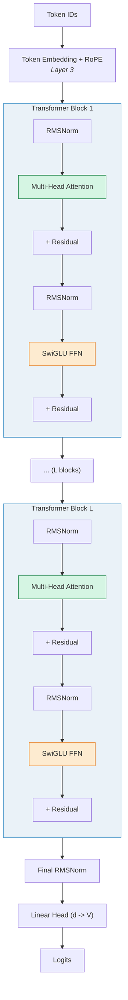
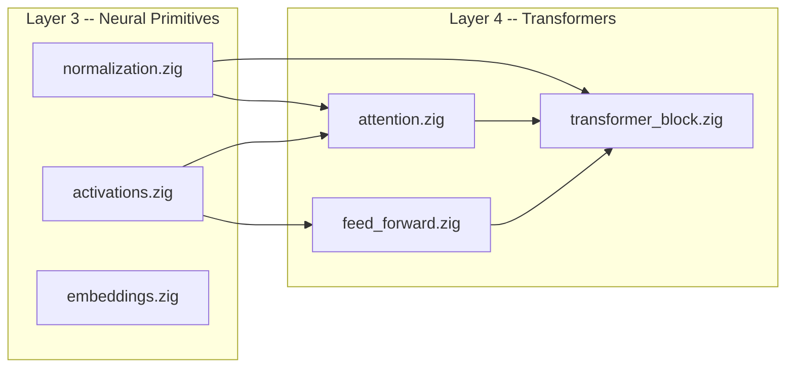

# Layer 4: Transformers

The **Transformers** layer assembles the neural primitives from Layer 3
(activations, normalizations, embeddings) into the architectural components
introduced in *Attention Is All You Need*.[^1]  This is where ZigLlama
transitions from generic numerical building blocks to structures that are
recognizably *language model* components: multi-head attention, position-wise
feed-forward networks, and complete transformer blocks with residual
connections.

Every production LLM -- GPT-4, LLaMA, Mistral, Claude, Gemini -- is built
from variations of the components described in this layer.  Understanding them
in depth is the single most important step toward understanding how these
models work.

---

## Learning Objectives

After completing the three modules in this layer you will be able to:

1. **Derive** the scaled dot-product attention formula, explain the role of
   the \(\sqrt{d_k}\) scaling factor, and implement it from scratch.
2. **Compare** Multi-Head Attention (MHA), Grouped-Query Attention (GQA), and
   Multi-Query Attention (MQA) in terms of parameter count, KV-cache size,
   and inference throughput.
3. **Explain** why the feed-forward network uses a hidden dimension
   \(d_{ff} \gg d_{\text{model}}\), and why SwiGLU-based FFNs use
   \(d_{ff} = \frac{8}{3}d_{\text{model}}\) to match the parameter count of
   standard FFNs.
4. **Trace** the forward pass of a complete pre-norm transformer block,
   identifying every residual connection, normalization, and projection.
5. **Apply** scaling laws (Chinchilla) to estimate parameter count, compute
   budget, and optimal training data for a given model size.

---

## Historical Context

!!! info "The Transformer Revolution"

    The Transformer architecture (Vaswani et al. 2017) replaced recurrent and
    convolutional sequence models with a purely attention-based design.  Its key
    innovations were:

    1. **Self-attention** to model all pairwise interactions in a sequence.
    2. **Multi-head** decomposition for parallel, diverse attention patterns.
    3. **Positional encoding** to inject sequence order into a permutation-
       equivariant architecture.
    4. **Residual connections + layer normalization** for stable training of
       deep stacks.

    Within two years, Transformers had become the dominant architecture for NLP
    (BERT, GPT-2), and by 2023 they had extended to vision (ViT), protein
    folding (AlphaFold), and code generation (Codex).

---

## Components Overview

| Module | Page | Source | Key Types |
|---|---|---|---|
| **Attention Mechanisms** | [attention-mechanisms.md](attention-mechanisms.md) | `src/transformers/attention.zig` | `MultiHeadAttention`, `AttentionType`, `scaledDotProductAttention` |
| **Feed-Forward Networks** | [feed-forward-networks.md](feed-forward-networks.md) | `src/transformers/feed_forward.zig` | `FeedForward`, `FFNType`, `ExpertFFN` |
| **Transformer Blocks** | [transformer-blocks.md](transformer-blocks.md) | `src/transformers/transformer_block.zig` | `TransformerBlock`, `Transformer`, `NormPlacement` |

---

## Data Flow Through a Transformer

The following diagram traces a single forward pass from token IDs to logits.
Layers 1-3 appear in grey; Layer 4 components are highlighted.

---

## Parameter Distribution

For a typical LLaMA-style model, parameters are distributed as follows:

| Component | Parameters per Block | Fraction |
|---|---|---|
| Attention (Q, K, V, O) | \(4 d^2\) (or less with GQA) | ~33% |
| Feed-Forward (gate, up, down) | \(3 \cdot d \cdot d_{ff}\) | ~67% |
| Normalization | \(2d\) (two RMSNorm layers) | <0.1% |
| **Total per block** | \(\approx 4d^2 + 3d \cdot d_{ff}\) | 100% |

With \(d_{ff} = \frac{8}{3}d\) (SwiGLU convention), the FFN parameters equal
\(8d^2\), so the ratio is roughly 1:2 attention-to-FFN.  The embedding table
adds \(Vd\) parameters outside the blocks.

---

## Dependency Graph

`transformer_block.zig` is the integration point: it imports both attention
and feed-forward modules plus normalization to compose the complete block.

---

## Notation Conventions

!!! notation "Symbols Used in This Layer"

    | Symbol | Meaning |
    |---|---|
    | \( n \) | Sequence length |
    | \( d \) or \( d_{\text{model}} \) | Model / embedding dimension |
    | \( d_k \) | Key (and query) dimension per head |
    | \( d_v \) | Value dimension per head |
    | \( h \) | Number of attention heads |
    | \( d_{ff} \) | Feed-forward hidden dimension |
    | \( L \) | Number of transformer blocks (layers) |
    | \( V \) | Vocabulary size |
    | \( N \) | Total parameter count |
    | \( W^Q, W^K, W^V, W^O \) | Attention projection matrices |
    | \( W_{\text{gate}}, W_{\text{up}}, W_{\text{down}} \) | SwiGLU FFN matrices |

---

## Suggested Reading Order

1. **[Attention Mechanisms](attention-mechanisms.md)** -- the core innovation;
   start here.
2. **[Feed-Forward Networks](feed-forward-networks.md)** -- the "processing"
   half of each block.
3. **[Transformer Blocks](transformer-blocks.md)** -- how attention and FFN
   combine with residuals and normalization into a complete block, then stack
   into a full model.

---

## Key Design Decisions in ZigLlama

!!! tip "Inference-Only Architecture"

    ZigLlama implements only the forward pass.  There are no gradient tensors,
    no optimizer state, and no backward pass.  This simplifies memory
    management dramatically and allows aggressive in-place computation.

!!! tip "Configurable Block Type"

    `TransformerBlock` accepts both `NormPlacement` (Pre-Norm / Post-Norm) and
    `FFNType` (Standard / SwiGLU / GeGLU / GLU) as initialization parameters,
    so the same struct can represent GPT-2-style, LLaMA-style, or
    BERT-style blocks.

---

## References

[^1]: Vaswani, A. et al. "Attention Is All You Need." *NeurIPS*, 2017.
[^2]: Touvron, H. et al. "LLaMA: Open and Efficient Foundation Language Models." *arXiv:2302.13971*, 2023.
[^3]: Jiang, A. Q. et al. "Mistral 7B." *arXiv:2310.06825*, 2023.
[^4]: Hoffmann, J. et al. "Training Compute-Optimal Large Language Models (Chinchilla)." *arXiv:2203.15556*, 2022.
