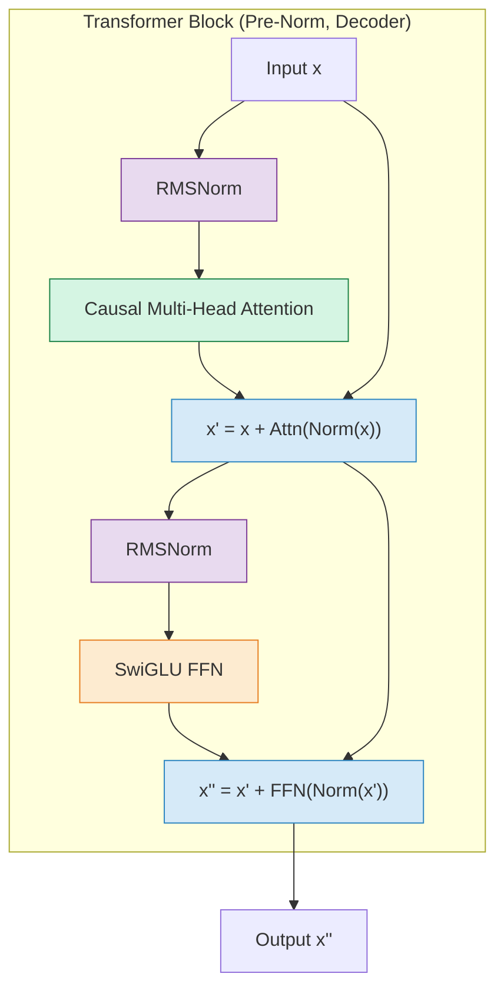
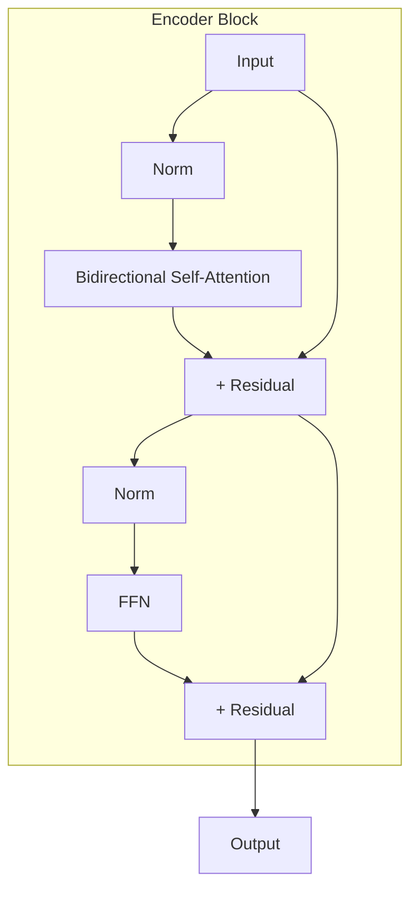
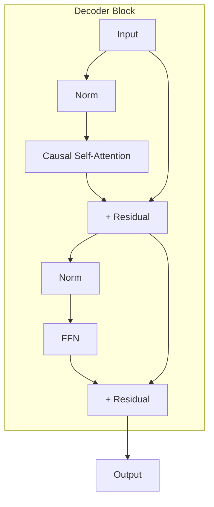
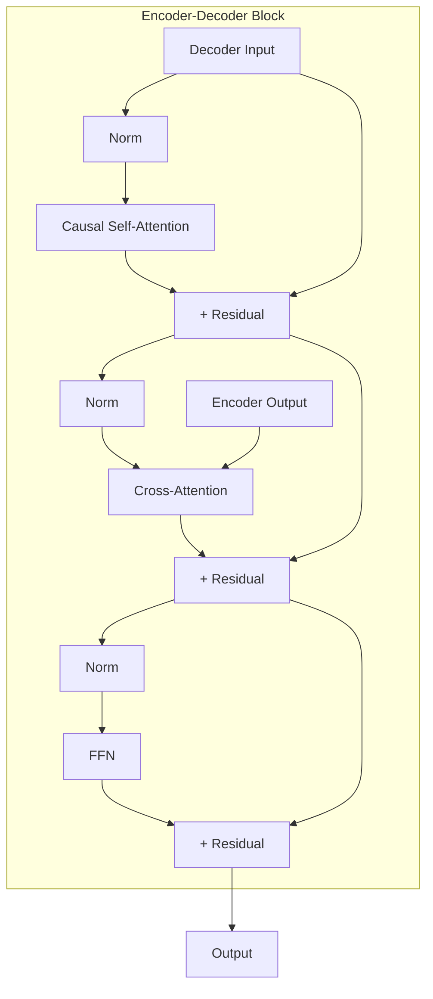

# Transformer Blocks

A **transformer block** is the fundamental repeating unit of every transformer
model.  It combines multi-head attention and a feed-forward network with
residual connections and normalization into a single module that is then stacked
\(L\) times to create the full model.  Getting the composition right --
especially the order of normalization and the structure of residual paths -- is
critical for training stability and inference quality.

---

## 1. Block Anatomy

Every transformer block contains four core components:

1. **Normalization** (RMSNorm or LayerNorm)
2. **Multi-Head Attention** (self-attention, possibly cross-attention)
3. **Feed-Forward Network** (SwiGLU, GELU, or standard)
4. **Residual Connections** (additive skip connections)

The order in which these are composed defines the block variant.



---

## 2. Pre-Norm Transformer Block (Modern Standard)

### 2.1 Formulation

!!! definition "Pre-Norm Block (LLaMA, GPT-3, Mistral)"

    \[
        x' = x + \operatorname{Attention}\!\bigl(\operatorname{Norm}(x)\bigr)
    \]

    \[
        x'' = x' + \operatorname{FFN}\!\bigl(\operatorname{Norm}(x')\bigr)
    \]

    Normalization is applied **before** each sub-layer, inside the residual
    branch.  The residual connection adds the *unnormalized* input to the
    sub-layer output.

### 2.2 Gradient Flow

The key advantage of Pre-Norm is that the residual connection provides a
**direct gradient path** from the loss to every layer:

\[
    \frac{\partial \mathcal{L}}{\partial x_\ell} =
    \frac{\partial \mathcal{L}}{\partial x_L}
    \prod_{k=\ell}^{L-1}
    \left(I + \frac{\partial f_k(\operatorname{Norm}(x_k))}{\partial x_k}\right)
\]

Even if the sub-layer Jacobian \(\partial f_k / \partial x_k\) is small, the
identity matrix \(I\) ensures the gradient is at least 1 along the skip path.
This prevents vanishing gradients in very deep models (\(L > 80\)).

---

## 3. Post-Norm Transformer Block (Original)

!!! definition "Post-Norm Block (Original Transformer, BERT)"

    \[
        x' = \operatorname{Norm}\!\bigl(x + \operatorname{Attention}(x)\bigr)
    \]

    \[
        x'' = \operatorname{Norm}\!\bigl(x' + \operatorname{FFN}(x')\bigr)
    \]

    Normalization is applied **after** the residual addition.

### 3.1 Gradient Flow Issue

In Post-Norm, the gradient must pass *through* the normalization layer at every
block:

\[
    \frac{\partial \mathcal{L}}{\partial x_\ell} =
    \frac{\partial \mathcal{L}}{\partial x_L}
    \prod_{k=\ell}^{L-1}
    \frac{\partial \operatorname{Norm}(x_k + f_k(x_k))}{\partial x_k}
\]

The normalization Jacobian is not the identity and can attenuate or amplify
gradients unpredictably, especially in deep networks.

!!! warning "Training Instability"

    Post-Norm is known to cause training divergence in deep models (\(L > 24\))
    without careful learning rate warmup and initialization.  The seminal
    analysis by Xiong et al. (2020) showed that Pre-Norm resolves this by
    ensuring well-behaved gradient norms at initialization.[^1]

---

## 4. Residual Connections

### 4.1 Mathematical Foundation

!!! definition "Residual Connection"

    For a sub-layer function \(f\):

    \[
        x_{\text{out}} = x + f(x)
    \]

    The gradient is:

    \[
        \frac{\partial x_{\text{out}}}{\partial x} = I + \frac{\partial f}{\partial x}
    \]

### 4.2 Why Residuals Matter

Without residual connections, the gradient through \(L\) layers would be:

\[
    \frac{\partial \mathcal{L}}{\partial x_0} =
    \prod_{\ell=1}^{L} \frac{\partial f_\ell}{\partial x_{\ell-1}}
\]

If any factor has spectral norm less than 1, the product vanishes
exponentially.  With residual connections, the product includes an identity
term at each layer, creating a "gradient highway" that ensures at least one
path with magnitude 1.

### 4.3 Signal Propagation

Residual connections also help with **forward signal propagation**.  Without
them, the model must learn the identity function at each layer before it can
learn useful transformations.  With residuals, the default behavior is identity
(pass input through unchanged), and each layer learns an *additive correction*.

---

## 5. Encoder, Decoder, and Encoder-Decoder Blocks

### 5.1 Encoder Block (BERT, Vision Transformer)



- **Bidirectional attention:** Every position sees every other position.
- **No causal mask:** Appropriate for understanding tasks.
- **Use cases:** Classification, named entity recognition, sentence embeddings.

### 5.2 Decoder Block (GPT, LLaMA)



- **Causal self-attention:** Position \(i\) attends only to positions \(\leq i\).
- **Autoregressive:** Generates tokens one at a time.
- **Use cases:** Text generation, code completion, language modeling.

### 5.3 Encoder-Decoder Block (T5, BART)



- **Three sub-layers:** Causal self-attention, cross-attention, FFN.
- **Cross-attention:** Queries from decoder, keys/values from encoder.
- **Use cases:** Machine translation, summarization, seq2seq tasks.

---

## 6. Layer Stacking

### 6.1 Composition

A complete transformer is simply \(L\) identical blocks applied sequentially,
preceded by an embedding layer and followed by a final normalization and
output projection:

\[
    \text{output} = \operatorname{Norm}\!\left(
        \underbrace{f_L \circ f_{L-1} \circ \cdots \circ f_1}_{L \text{ blocks}}
        (\operatorname{Embed}(\text{tokens}))
    \right) W_{\text{head}}
\]

where \(W_{\text{head}} \in \mathbb{R}^{d \times V}\) is the language model
head that produces logits over the vocabulary.

### 6.2 Typical Configurations

| Model | \(L\) | \(d\) | \(h\) | \(d_{ff}\) | FFN Type | Parameters |
|---|---|---|---|---|---|---|
| GPT-2 Small | 12 | 768 | 12 | 3072 | GELU | 117M |
| GPT-2 XL | 48 | 1600 | 25 | 6400 | GELU | 1.5B |
| LLaMA 7B | 32 | 4096 | 32 | 11008 | SwiGLU | 6.7B |
| LLaMA 13B | 40 | 5120 | 40 | 13824 | SwiGLU | 13B |
| LLaMA 65B | 80 | 8192 | 64 | 22016 | SwiGLU | 65B |
| Mistral 7B | 32 | 4096 | 32 | 14336 | SwiGLU | 7.3B |

---

## 7. Scaling Laws

### 7.1 Chinchilla Parameter Estimate

!!! theorem "Parameter Count Approximation (Hoffmann et al. 2022)"

    For a decoder-only transformer with \(L\) layers and model dimension \(d\)
    (using \(d_{ff} = 4d\) standard FFN):[^2]

    \[
        N \approx 12\, L\, d^2
    \]

    This comes from \(L\) layers, each with \(4d^2\) attention parameters and
    \(8d^2\) FFN parameters, totaling \(12d^2\) per layer.

### 7.2 FLOPs per Token

!!! complexity "Compute Budget"

    The forward pass FLOPs per token for a transformer with \(N\) parameters
    is approximately:[^2]

    \[
        C_{\text{forward}} \approx 2N \;\text{FLOPs/token}
    \]

    Including the backward pass (for training):

    \[
        C_{\text{train}} \approx 6N \;\text{FLOPs/token}
    \]

    For LLaMA-7B: \(C_{\text{forward}} \approx 2 \times 6.7 \times 10^9 \approx 13.4\) GFLOPs per token.

### 7.3 Chinchilla Optimal Training

The Chinchilla scaling law states that the optimal number of training tokens
\(D\) for a model with \(N\) parameters is:

\[
    D_{\text{optimal}} \approx 20\, N
\]

For a 7B parameter model, this suggests ~140B training tokens.

---

## 8. Implementation in ZigLlama

### 8.1 TransformerBlock Struct

```zig
pub const TransformerBlock = struct {
    block_type: TransformerBlockType,     // Encoder, Decoder, EncoderDecoder
    norm_placement: NormPlacement,         // PreNorm or PostNorm
    d_model: usize,

    self_attention: MultiHeadAttention,
    cross_attention: ?MultiHeadAttention,  // only for EncoderDecoder
    ffn: FeedForward,

    norm1: Tensor(f32),                   // scale params for attention norm
    norm1_bias: Tensor(f32),              // bias params
    norm2: Tensor(f32),                   // scale params for FFN norm
    norm2_bias: Tensor(f32),
    norm3: ?Tensor(f32),                  // cross-attention norm (enc-dec only)
    norm3_bias: ?Tensor(f32),

    allocator: Allocator,

    pub fn init(
        allocator: Allocator,
        d_model: usize,
        num_heads: usize,
        d_ff: usize,
        block_type: TransformerBlockType,
        norm_placement: NormPlacement,
        ffn_type: FFNType,
    ) !TransformerBlock {
        const self_attention = try MultiHeadAttention.init(allocator, d_model, num_heads);
        var cross_attention: ?MultiHeadAttention = null;
        if (block_type == .EncoderDecoder) {
            cross_attention = try MultiHeadAttention.init(allocator, d_model, num_heads);
        }
        const ffn = try FeedForward.init(allocator, d_model, d_ff, ffn_type);
        // Initialize norm parameters (scale=1, bias=0) ...
        return TransformerBlock{ ... };
    }
};
```

### 8.2 Block Type and Norm Placement Enums

```zig
pub const TransformerBlockType = enum {
    Encoder,         // Self-attention + FFN (BERT style)
    Decoder,         // Causal self-attention + FFN (GPT / LLaMA style)
    EncoderDecoder,  // Self-attention + Cross-attention + FFN (T5 style)
};

pub const NormPlacement = enum {
    PreNorm,    // Norm -> SubLayer -> Add  (modern, better gradient flow)
    PostNorm,   // SubLayer -> Add -> Norm  (original Transformer)
};
```

### 8.3 Pre-Norm Forward Pass

```zig
fn forwardEncoderPreNorm(
    self: *const TransformerBlock,
    input: Tensor(f32),
    mask: ?Tensor(f32),
) !Tensor(f32) {
    // --- Attention sub-layer ---
    // 1. Normalize
    var norm1_out = try normalization.layerNorm(f32, input, self.norm1, self.norm1_bias, self.allocator);
    defer norm1_out.deinit();

    // 2. Self-attention
    var attn_out = try self.self_attention.forward(norm1_out, norm1_out, norm1_out, mask);
    defer attn_out.deinit();

    // 3. Residual connection
    var residual1 = try input.add(attn_out, self.allocator);
    defer residual1.deinit();

    // --- FFN sub-layer ---
    // 4. Normalize
    var norm2_out = try normalization.layerNorm(f32, residual1, self.norm2, self.norm2_bias, self.allocator);
    defer norm2_out.deinit();

    // 5. Feed-forward
    var ffn_out = try self.ffn.forward(norm2_out);
    defer ffn_out.deinit();

    // 6. Residual connection
    return try residual1.add(ffn_out, self.allocator);
}
```

### 8.4 Transformer Struct (Full Model)

```zig
pub const Transformer = struct {
    num_layers: usize,
    d_model: usize,
    blocks: []TransformerBlock,
    final_norm: Tensor(f32),
    final_norm_bias: Tensor(f32),
    allocator: Allocator,

    pub fn init(
        allocator: Allocator,
        num_layers: usize,
        d_model: usize,
        num_heads: usize,
        d_ff: usize,
        block_type: TransformerBlockType,
        norm_placement: NormPlacement,
        ffn_type: FFNType,
    ) !Transformer {
        var blocks = try allocator.alloc(TransformerBlock, num_layers);
        for (0..num_layers) |i| {
            blocks[i] = try TransformerBlock.init(
                allocator, d_model, num_heads, d_ff,
                block_type, norm_placement, ffn_type,
            );
        }
        // Final normalization layer ...
        return Transformer{ .num_layers = num_layers, .blocks = blocks, ... };
    }

    pub fn forward(
        self: *const Transformer,
        input: Tensor(f32),
        encoder_output: ?Tensor(f32),
        mask: ?Tensor(f32),
    ) !Tensor(f32) {
        var current = input;
        var should_free = false;

        for (0..self.num_layers) |i| {
            const out = try self.blocks[i].forward(current, encoder_output, mask);
            if (should_free) current.deinit();
            current = out;
            should_free = true;
        }

        // Apply final layer normalization
        const final = try normalization.layerNorm(
            f32, current, self.final_norm, self.final_norm_bias, self.allocator,
        );
        if (should_free) current.deinit();
        return final;
    }
};
```

!!! info "Source File"

    Full implementation: `src/transformers/transformer_block.zig`
    (approximately 530 lines including encoder, decoder, encoder-decoder
    variants, and comprehensive tests).

---

## 9. Memory Management Pattern

ZigLlama uses Zig's `defer` to ensure every intermediate tensor is freed:

```zig
var attn_out = try self.self_attention.forward(...);
defer attn_out.deinit();  // freed when scope exits

var residual = try input.add(attn_out, self.allocator);
defer residual.deinit();
```

For the full `Transformer.forward`, a `should_free` flag tracks ownership of
the "current" tensor as it passes through layers, avoiding double-free and
use-after-free bugs.

!!! tip "Inference Memory"

    During inference, only the activations for the *current* layer need to be
    in memory simultaneously (plus the KV cache).  ZigLlama's explicit
    deallocation pattern means peak activation memory scales as
    \(O(n \cdot d)\), not \(O(L \cdot n \cdot d)\).

---

## 10. Exercises

1. **Trace** the forward pass of a Pre-Norm decoder block for a single
   input vector \(x \in \mathbb{R}^d\), writing out every intermediate
   tensor shape.
2. **Calculate** the total parameter count for LLaMA-7B using the formula
   \(N \approx 12Ld^2\) and compare with the actual 6.7B.
3. **Implement** a Post-Norm decoder block in ZigLlama by reordering the
   normalization calls relative to the residual additions.
4. **Derive** the gradient of the loss with respect to the input of block
   \(\ell\) in a 3-layer Pre-Norm transformer, showing how the identity
   matrix appears in each factor.
5. **Estimate** the training compute (in FLOPs) required for a Chinchilla-
   optimal 7B model, using \(C \approx 6ND\).

---

## References

[^1]: Xiong, R. et al. "On Layer Normalization in the Transformer Architecture." *ICML*, 2020.
[^2]: Hoffmann, J. et al. "Training Compute-Optimal Large Language Models (Chinchilla)." *arXiv:2203.15556*, 2022.
[^3]: Vaswani, A. et al. "Attention Is All You Need." *NeurIPS*, 2017.
[^4]: He, K. et al. "Deep Residual Learning for Image Recognition." *CVPR*, 2016.
[^5]: Touvron, H. et al. "LLaMA: Open and Efficient Foundation Language Models." *arXiv:2302.13971*, 2023.
